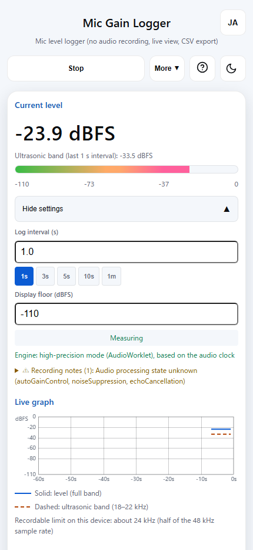
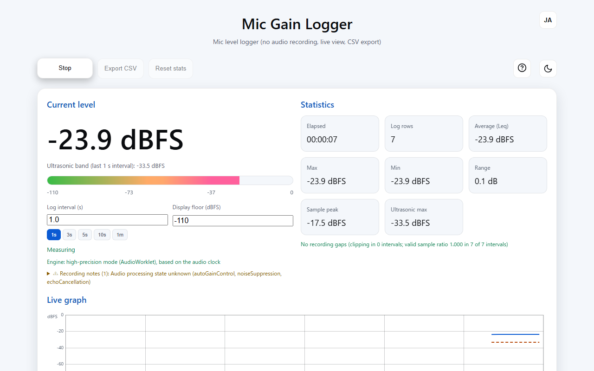

English · [日本語](README.md)

# Mic Gain Logger - Microphone level logger


[](https://ipusiron.github.io/mic-gain-logger/)

**Day041 - 100 Security Tools with Generative AI**

**Mic Gain Logger** is a browser-based tool that deliberately has no audio recording feature: it visualizes the "presence" and "strength" of the sound at the microphone input (the level in dBFS) in real time and keeps logging it.

Its output is a time series of dBFS, a relative value; it is not sound pressure (dB SPL), so it cannot be compared with regulatory limits or standard values. What it can do is keep a timestamped record that "sound activity increased or decreased on the same device within the same session."

---

## 🌐 Demo

👉 [https://ipusiron.github.io/mic-gain-logger/](https://ipusiron.github.io/mic-gain-logger/)

---

## 📸 Screenshots

<a href="assets/en/screenshot.png">
  
</a>

<sub>The screen while recording (desktop). The current ultrasonic band value appears under the large number, and the graph shows the dashed ultrasonic band line</sub>

<a href="assets/en/screenshot2.png">
  
</a>

<sub>Settings opened at phone width (430 px). Export and reset are grouped under "More"</sub>

<a href="assets/en/screenshot3.png">
  
</a>

<sub>The dark theme</sub>

<sub>All of these were taken with 1 kHz, 440 Hz and 19 kHz test signals fed in place of a microphone. With a real microphone, the values differ. The phone-width screenshot was taken with the browser width set to 430 px, not on a real device. The Japanese screens are in `assets/`.</sub>

---

## ✨ Features

- A level logger that does not record audio: logs the microphone input level (dBFS) one row per interval, without saving any audio. The browser enforces the CSP (`connect-src 'none'`) to block external data transmission
- Recording without missing intervals (AudioWorklet): intervals are aggregated on the audio thread, so recording continues even when drawing on the screen stops. Where the AudioWorklet cannot be loaded, the tool runs in fallback mode
- Recording the ultrasonic band (18–22 kHz): for each interval, the energy of the ultrasonic band and of the audible band (20–18,000 Hz) is kept on the same row. The band values record sound energy; they cannot tell what the sound is
- Live display: shows the big number, a meter, a graph of the last 60 seconds (the ultrasonic band as a dashed line) and the current value of the ultrasonic band. The big number is the value of the latest 2048 samples, so its window differs from that of the `dbfs` in the high-precision mode CSV (the energy average over the whole interval)
- Statistics: shows Elapsed, Log rows, Average (Leq), Max, Min, Range, Sample peak and Ultrasonic max. The average is an energy average, weighted by interval length (seconds), not by row count
- Recording gaps display: clipping and problems with the valid sample ratio are shown on screen whether or not there are any (with no gaps, it says "No recording gaps")
- CSV (v3) and hash chain: data rows are exported between header lines with the measurement conditions and trailer lines with facts known only after recording ends. The per-row hashes let you notice accidental corruption, partial loss and reordering (they do not withstand intentional changes)
- Telling silence from missing data: digital silence is kept as a row with `-Infinity`, and for an interval where no sample arrived, `dbfs` is left empty
- Noticing microphone disconnection, clock jumps and audio processing: a lost microphone, muting at the source, a stopped AudioContext, and audio processing (AGC, noise suppression, echo cancellation) left on are all shown on screen as they happen (clock jumps and the state of audio processing are also kept in the CSV)
- Changing settings in real time: the log interval (1s/3s/5s/10s/1m) and the display floor can be changed during recording. The display floor is a display-only setting; recorded values do not change
- Cumulative data recording: repeating "Start recording → Stop → Start recording" keeps adding to the log and statistics. "Reset stats" clears them all at once
- Phone support: at 480 px wide or narrower, Start recording/Stop, "More", Help and the theme switch sit on one row
- Japanese and English display: switch with the button at the top right of the header or with `?lang=`. The CSV contents are the same regardless of language
- Dark mode and light mode: the theme can be switched (the choice is saved)

Detailed descriptions are in the [features document](docs/en/features.md).

---

## 📖 Usage

### Recording

1. Open the [demo page](https://ipusiron.github.io/mic-gain-logger/), press "Start recording" and allow microphone access. If you leave the permission dialog alone, it times out after 20 seconds; while connecting, "Stop" cancels the request
2. Check "Engine" at the top of the screen to confirm that the tool is running in high-precision mode (AudioWorklet). In fallback mode, recording stops when drawing on the screen stops
3. While recording, the big number, meter, graph and statistics move, and the log grows by one row per interval
4. When you finish, press "Stop". Pressing "Start recording" again continues recording into the same log

### Changing settings

- The log interval (a 1s/3s/5s/10s/1m preset, or a number of seconds) and the display floor can be changed during recording. A change of log interval takes effect from the next interval boundary
- The default display floor is -110 dBFS (-90 dBFS when opened with `?bands=off`). It is a display-only setting; the values recorded in the CSV do not change
- At 480 px wide or narrower, the settings are collapsed; press "Show settings" to open them

### Exporting the CSV

- Press "Stop", then "Export CSV". The export button cannot be pressed during recording
- At 480 px wide or narrower, "Export CSV" and "Reset stats" are inside "More"
- ⚠The log exists only in the browser's memory. Closing or reloading the tab erases it, so export first
- Press "Reset stats" after stopping recording. It clears the log, statistics, graph and notes at once
- The CSV format, the verification steps and the analysis recipes are in the [CSV document](docs/en/csv.md)

### Switching the display language

1. With the button: press the button at the top right of the header. It shows `EN` on the Japanese display and `JA` on the English display (the language it switches to). The chosen language is saved in the browser's `localStorage` (key `mic-gain-logger-lang`) and used the next time you open the page
2. With the URL: open the page with `?lang=en` or `?lang=ja` (for example, `https://ipusiron.github.io/mic-gain-logger/?lang=en`). To use it together with `?bands=off`, join them as in `?bands=off&lang=en`. If you switch with the button while the page is open with `?lang=`, the `?lang=` in the URL is rewritten too (so that reloading does not bring back the original language)
3. With neither: if no language has been saved, the browser language is used. If the first entry of `navigator.languages` is Japanese (`ja`, `ja-JP` and so on), the display is Japanese; otherwise it is English

- The order is "`?lang=` → saved language → browser language". Values other than `ja` and `en` (such as `?lang=fr`) are ignored, and the next step in the order is used
- Switching also works when `localStorage` is unavailable, as in private browsing. The choice is not saved, so the next time the language is decided by `?lang=` or the browser language
- Switching changes only the display. Switching during recording does not affect the recording, statistics, graph or hash chain. The notes currently shown, the recording gaps line, the current value of the ultrasonic band, the limit display, the legend and the status display are redrawn in the new language
- The CSV contents (the `key=value` of the header lines and the column names) and the exported file name are the same regardless of language. The microphone name (`# device=`) is kept as the string returned by the device and is not translated
- For a moment before the script runs, the Japanese written in the HTML appears (even if you chose English)

### Stopping band computation (`?bands=off`)

Opening the page with `?bands=off` at the end of the URL (for example, `https://ipusiron.github.io/mic-gain-logger/?bands=off`) stops the computation of the bands (the ultrasonic band and the audible band). It is for comparing the valid sample ratio with and without bands in the same version. When it is stopped, the three band columns in the CSV are empty and the header says `# bands=off`. On screen, the legend and the notes say that it is stopped, the ultrasonic band line is not drawn, and "Ultrasonic max" stays at `--.-`. The default display floor becomes -90 dBFS.

---

## 🎯 Use cases

What this tool keeps is a time series of dBFS, a value relative to each device. It is not sound pressure (dB SPL), so it cannot be compared with regulatory limits or standard values; the band values cannot tell what the sound is; and the records cannot be used as proof. The author does not encourage misuse. Whether you may record depends on the laws and circumstances of your country or region (see "⚖️ Usage notes (not legal advice)" below).

### 🧭 Examples of use (summary)

- Comparing with a baseline: set a baseline recording made with the same device, the same placement and the same log interval side by side with the recording in question, and look for times when the sound (including the ultrasonic band) was higher than usual
- Daily life and home: when home appliances were running, pets home alone, your own snoring and instrument practice time, high-pitched sounds from devices around you
- Education and learning: the difference between dBFS and dB SPL, sampling frequency and Nyquist frequency, FFT windows and bins, the microphone limit of each device, noticing differences in hearing
- Work and creative projects: preparing for recording sessions, estimating how long equipment ran
- Hobbies, electronics and nature watching: checking oscillator circuits and buzzers, the time birds start singing, insect sounds at night
- Research and security audits: auditing and testing air gaps, finding the direction of a sound and narrowing down its source, checking the limits of the hash chain
- Combining with other tools and articles: 『エアギャップ・ブリッジ』 (*Air Gap Bridge*) (Japanese-language book), the tone source page (Tone Sweep), spreadsheets and Python

⚠Every example of use has the following limits. Recording is possible only up to half the sample rate (24 kHz at 48 kHz), and sounds above 24 kHz cannot be recorded at their own frequency. dBFS from two devices cannot be compared, and one microphone cannot tell direction, so direction finding is done while moving the device.

Target users, intended uses, why the values cannot be compared with regulatory limits or standard values, who does what and what they learn in each example of use together with its limits, and example scenarios (keeping activity times in a private investigation, finding the times when sound concentrates in an office) are in the [use cases document](docs/en/use-cases.md).

---

## ⚖️ Usage notes (not legal advice)

This tool records only the level; it does not record the audio itself. Even so, continuously recording the sound of other people's living spaces or workplaces can be subject to legal restrictions. What becomes a problem depends on the purpose of the recording, where the device was placed, how long it recorded and who is shown the record.

The following covers only what could be confirmed in the original texts in e-Gov Law Search (Japan) as of 2026-09-28. This document does not determine whether any particular law applies. Law names and quotations are unofficial English translations of the Japanese originals.

### What we confirmed in the original texts

- Use in transactions or certification: **This tool's output cannot be used for transactions or certification.** A sound level meter is a "specified measuring instrument" under the Measurement Act (Order for Enforcement of the Measurement Act, Article 2, item 15). A specified measuring instrument without the mark of having passed verification, and anything that is not a measuring instrument, must not be used for measurement in transactions or certification, nor possessed to be offered for such use (Measurement Act, Article 16, paragraph 1). Violations are subject to penalties (the same Act, Article 172, item 1). Article 2, paragraph 2 of the Measurement Act defines "certification" as "stating, publicly or in the course of business, to another person that a certain fact is true"
- Regulatory standards of the Noise Regulation Act: comparing with them requires a sound level meter that has passed verification. The notice that sets out how the regulatory standards are measured limits the instrument to "a sound level meter that has passed the conditions of Article 71 of the Measurement Act," and specifies that the A characteristic be used for the frequency weighting network and the fast time weighting (FAST) for the dynamic characteristic (Standards for the Regulation of Noise Generated at Specified Factories, etc.: Notice No. 1 of 1968 of the Ministry of Health and Welfare, the Ministry of Agriculture and Forestry, the Ministry of International Trade and Industry and the Ministry of Transport, Remark 3)
- Occupational noise standard values: they are equivalent continuous A-weighted sound pressure levels. The measurement method is set by Article 4 of the Working Environment Measurement Standards (Ministry of Labour Notice No. 46 of 1976), which states that "the instrument used for measurement (hereinafter "sound level meter") shall be capable of measuring the equivalent continuous sound level" and that measurement "shall be made with the A characteristic of the frequency weighting network of the sound level meter"
- Notification for private investigation business: a business that investigates the whereabouts and actions of other people as a trade is required to file a notification (Act on Ensuring the Proper Conduct of Private Investigation Business, Article 4, paragraph 1). Article 6 of the same Act provides that private investigators "shall bear in mind that this Act does not make it possible to perform acts that are prohibited or restricted by other laws and regulations, and shall not infringe on the rights and interests of individuals, such as by disturbing the peace of people's lives." Filing a notification does not make the act of recording itself lawful

### What to check before use

- Whether you have the authority to enter the place where you record
- Whether the people being recorded have consented, or whether there is a legitimate basis in place of consent
- Whether the data obtained is kept within the scope of the purpose and can be deleted once it is not needed
- If you plan to give the record to a third party, whether you checked in advance that it may be given

### Operating principles (practical guidance, not law)

- Minimum scope: record only what is needed to achieve the purpose
- Transparency: as far as possible, make clear that you are recording and why
- Data minimization: delete records promptly once they are not needed
- Limiting disclosure to third parties: do not give records to others without a legitimate reason

### What this section does not cover

The list above is not an exhaustive list of the laws that may apply. Civil privacy infringement, entering the place of recording, the handling of personal information, local government ordinances and similar matters are not considered here. Before actual use, please consult a lawyer or another professional.

(Checked on 2026-09-28. Sources: e-Gov Law Search https://laws.e-gov.go.jp/ , Ministry of the Environment https://www.env.go.jp/hourei/07/000052.html , Ministry of Health, Labour and Welfare https://www.mhlw.go.jp/content/001089239.pdf )

---

## 📚 Documents (docs/en/)

This README is the entry point and gives only the key points; the detailed explanations are split into `docs/en/` (the Japanese originals are in `docs/`).

| File | Contents |
|---|---|
| [docs/en/features.md](docs/en/features.md) | Detailed descriptions of the features (screen display, recording and statistics, record contents and CSV, operation and display settings) |
| [docs/en/csv.md](docs/en/csv.md) | CSV format (columns, missing data, band columns, header, trailer, log intervals, session boundaries), what the hash chain can tell you, the verifier, steps for Excel/Google Sheets, recommended analysis methods, Python recipes, multiple CSVs and records from two devices |
| [docs/en/real-device-test.md](docs/en/real-device-test.md) | The real-device test on an iPhone 18 Pro Max (device and conditions, valid sample ratio while computing the FFT, the 18–22 kHz step sequence, fan and speaker, what has not been tested, how to run it) |
| [docs/en/measurement.md](docs/en/measurement.md) | How measurement works and measured values, dBFS basics, the difference between the big number on screen and the CSV `dbfs`, security background, tech stack and how to read the implementation |
| [docs/en/use-cases.md](docs/en/use-cases.md) | Target users, intended uses, why the values cannot be compared with regulatory limits or standard values, the full examples of use, example scenarios |
| [docs/en/troubleshooting.md](docs/en/troubleshooting.md) | Common problems and solutions |
| [docs/en/roadmap.md](docs/en/roadmap.md) | What Phase 2 added, ideas for Phase 3, further ideas, what will not be added |

---

## 🧪 Tests

```bash
npm test
```

- Runs on Node.js 22 or later. There are no dependencies; `package.json` only calls `node --test`
- GitHub Actions (`.github/workflows/test.yml`) runs the same `npm test` on every push and pull request
- The tests check not only the implementation but also the tables and numbers in the README and docs/: the verifier results table (`test/chain-claim.test.js`), the Leq check values (`test/session-weight.test.js`), the directory structure (`test/docs.test.js`), the real-device test tables (`test/readme-realdevice.test.js`), the output of the CSV recipes (`test/readme-recipes.test.js`), the heading order and the examples of use (`test/readme-structure.test.js`), and how the README and docs/ are split, cross-referenced and emphasized (`test/readme-docs.test.js`)
- The README does not state the number of tests. Check it in the `npm test` output (a written number would go out of date)

---

## 📁 Directory structure

```
mic-gain-logger/
├── index.html                     # Main page (UI, help modal, CSP declaration)
├── style.css                      # Stylesheet (dark/light mode, mobile optimization)
├── script.js                      # DOM and browser APIs (microphone access, drawing, CSV export)
├── logic.js                       # Pure logic (dBFS conversion, intervals, statistics, graph coordinates, CSV assembly)
├── messages.js                    # UI text dictionaries (Japanese and English) and how the display language is chosen
├── worklet/                       # Code that runs on the audio thread
│   └── meter-processor.js         # AudioWorkletProcessor (per-interval aggregation)
├── docs/                          # Detailed documents in Japanese, listed in the document table of README.md
│   ├── en/                        # Detailed documents in English (same file names), listed in "📚 Documents (docs/en/)" above
│   │   ├── features.md            # Detailed descriptions of the features
│   │   ├── csv.md                 # CSV format, hash chain, verifier, Excel steps, Python recipes
│   │   ├── real-device-test.md    # Conditions, results and procedure of the iPhone 18 Pro Max real-device test
│   │   ├── measurement.md         # How measurement works, measured values, dBFS basics, security background, tech stack
│   │   ├── use-cases.md           # Target users, intended uses, why regulatory limits cannot be compared, examples of use, scenarios
│   │   ├── troubleshooting.md     # Common problems and solutions
│   │   └── roadmap.md             # What Phase 2 added, ideas for Phase 3, further ideas, what will not be added
│   ├── features.md                # Detailed descriptions of the features (Japanese)
│   ├── csv.md                     # CSV format, hash chain, verifier, Excel steps, Python recipes (Japanese)
│   ├── real-device-test.md        # Conditions, results and procedure of the iPhone 18 Pro Max real-device test (Japanese)
│   ├── measurement.md             # How measurement works, measured values, dBFS basics, security background, tech stack (Japanese)
│   ├── use-cases.md               # Target users, intended uses, why regulatory limits cannot be compared, examples of use, scenarios (Japanese)
│   ├── troubleshooting.md         # Common problems and solutions (Japanese)
│   └── roadmap.md                 # What Phase 2 added, ideas for Phase 3, further ideas, what will not be added (Japanese)
├── test/                          # Tests (node:test, no dependencies)
│   ├── logic.test.js              # Pure functions (clamp, dBFS conversion, time formatting, and others)
│   ├── interval.test.js           # Building "one row = one interval"
│   ├── meter-processor.test.js    # Runs the worklet itself inside node:vm
│   ├── clock.test.js              # Clock drift caused by AudioContext suspension
│   ├── silence.test.js            # Keeping digital silence in the record
│   ├── device.test.js             # Noticing loss of the microphone device
│   ├── connect.test.js            # Microphone acquisition timeout and cancellation
│   ├── meta.test.js               # Measurement-condition metadata
│   ├── css.test.js                # Selector order (settings UI on phones)
│   ├── canvas.test.js             # Canvas size (RangeError, hard-coded px, horizontal overflow)
│   ├── graph.test.js              # Real-time horizontal axis, ticks and labels
│   ├── stats-csv.test.js          # On-screen statistics match statistics recomputed from the CSV
│   ├── contrast.test.js           # Contrast ratios in both themes
│   ├── cleanup.test.js            # Dead code, input fonts, touch targets
│   ├── hashchain.test.js          # Hash chain (origin, trailer, finding loss and reordering)
│   ├── chain-runner.test.js       # Container that advances the chain during recording (asynchronous state machine)
│   ├── chain-claim.test.js        # What the chain claims, and whether the verifier tables match measurements
│   ├── smoothing.test.js          # No smoothing setting, and the explanation of why
│   ├── stats-weight.test.js       # Weighting statistics (Leq) by interval length
│   ├── stats-notice.test.js       # Peak, clipping, valid sample ratio and the recording gaps display
│   ├── interval-label.test.js     # Labeling each row with its measured interval length as the log interval
│   ├── session-weight.test.js     # Steps and check values for weights across stop → restart
│   ├── reset.test.js              # Reset stats discards the population (log, statistics, graph, notes) at once
│   ├── processing-label.test.js   # Writing processing in the meta line as one of three values: off/active/unknown
│   ├── clip-notice.test.js        # Clipping notes (denominator, single hits and sustained runs) and the name "sample peak"
│   ├── css-order.test.js          # Whether width-dependent rules are canceled by later plain rules
│   ├── meter-floor.test.js        # Meter ticks and the default display floor (-110 dBFS with bands, -90 dBFS with ?bands=off)
│   ├── notice-details.test.js     # Notes as "one line with the count and key points + full text when opened"
│   ├── review-ui.test.js          # Screen details (graph while stopped, ticks, button heights)
│   ├── fft.test.js                # FFT basics (match with a naive DFT, one-sided spectrum normalization, no-allocation rule)
│   ├── band.test.js               # Per-interval band aggregation (bin assignment, 75% overlap, interruptions, band valid ratio of the first row)
│   ├── csv-v3.test.js             # CSV v3 (three band columns, header rules, empty cells for missing data, one procedure for v2 and v3)
│   ├── band-ui.test.js            # Bands on screen (dashed ultrasonic band line, breaks at missing data, Ultrasonic max, notes, recordable limit)
│   ├── mobile-view.test.js        # First view on phones (Start recording and Stop in one place, "More", dvh)
│   ├── ultra-now.test.js          # Current value of the ultrasonic band, and the different windows of the big number and the CSV value
│   ├── readme-realdevice.test.js  # Whether the real-device test tables match the real-device records (kept outside the repository)
│   ├── readme-recipes.test.js     # Recomputes the output of the CSV recipes from the sample CSV in JS and compares
│   ├── readme-structure.test.js   # Series-standard heading order, required examples of use, the on-screen number and the CSV value
│   ├── readme-docs.test.js        # How README and docs/ are split (line count, index table, cross-references, emphasis count, current version only)
│   ├── no-bold-labels.test.js     # List-item labels are not bold (README and docs/, both languages)
│   ├── readme-en.test.js          # Whether README.en.md and docs/en/ match the Japanese versions (headings, numbers in tables, code processing, recipe outputs, terms)
│   ├── i18n.test.js               # Japanese/English UI (matching dictionary keys, no Japanese left in the English display, how the language is chosen)
│   ├── dbfs-fixture.test.js       # dBFS calculation accuracy for sine waves of known amplitude
│   ├── docs.test.js               # Whether the README and docs/ match the implementation and actual files (including the tree)
│   └── fixtures/                  # Expected values for tests
│       ├── expected_dbfs.json     # Expected dBFS made from sine waves of known amplitude
│       └── sample_v2.csv          # Sample v2 (7-column) CSV (to confirm that the verifier also passes v2)
├── assets/                        # Favicon and images for the README
│   ├── favicon.svg                # Favicon (level meter bars; no external fetches)
│   ├── screenshot.png             # Screen while recording (light theme)
│   ├── screenshot2.png            # Settings opened at phone width
│   ├── screenshot3.png            # Screen while recording (dark theme)
│   └── en/                        # English screens (for README.en.md)
│       ├── screenshot.png         # Screen while recording (light theme, English)
│       ├── screenshot2.png        # Settings opened at phone width (English)
│       └── screenshot3.png        # Screen while recording (dark theme, English)
├── .github/                       # GitHub settings
│   └── workflows/                 # GitHub Actions workflows
│       └── test.yml               # CI (runs npm test on push and pull request)
├── package.json                   # npm test definition (no dependencies)
├── .nojekyll                      # Disables Jekyll processing on GitHub Pages (empty file)
├── .gitignore                     # Git exclusion settings
├── CLAUDE.md                      # Development guide (file roles, measurement notes, CSV rules, README and docs/ structure)
├── README.md                      # Entry point of the project documentation (Japanese)
├── README.en.md                   # Entry point of the project documentation in English (this file)
└── LICENSE                        # MIT license
```

---

## 💻 Requirements

### Browser support

This is the only place that states how far the tool has been verified. The scenario examples, measured values and real-device test in docs/en/ all point here (the [real-device test document](docs/en/real-device-test.md) holds the measured values and how they were measured).

⚠**Only one real device has been tested: an iPhone 18 Pro Max (iOS Safari) (2026-09-29).**

- Versions tested: two public versions, `c7b6bad` and `090648f` (band recording is in `090648f`). The sample rate was 48000 Hz
- From recording to CSV verification: in both versions, the AudioWorklet module loaded and the tool ran in high-precision mode, and recording → stopping → exporting the CSV worked. Every exported CSV passed the verifier in "Verifying a CSV you received" in the [CSV document](docs/en/csv.md)
- Confirmed with the real-device CSVs: in `090648f`, band recording (the worklet's FFT and CSV v3), how the processing state is written (`unknown:`), and the `valid_ratio` of the first row. That computing the FFT does not drop render quanta was confirmed with 1-minute and 2-minute recordings with the screen on
- Seen on screen (from the author's memory): at 21 kHz the dashed ultrasonic band line appeared, and at 22 kHz it stuck to the bottom at the display floor of the recorded version (-90 dBFS) and could not be seen. The dashed ultrasonic band line on screen cannot be confirmed from the CSV
- Not tested: real Android devices, and screen-lock and background behavior on a real device. Long recordings, and other iPhones (different models or iOS versions). The screen features added after the real-device test version (`090648f`) (the default display floor of -110 dBFS, the current value of the ultrasonic band, the button layout), and switching between Japanese and English (tested only in desktop Chromium)

The measured values such as row counts and `valid_ratio` are in the [real-device test document](docs/en/real-device-test.md). The remaining checks at mobile widths were done in desktop Chromium (Playwright) by creating widths of 320–430 px, 4x/20x CPU throttling and a state equivalent to a screen lock. The "screen-lock equivalent" is a browser emulation, not a real screen lock.

| Browser | Desktop | Mobile | Notes |
|---|---|---|---|
| Chrome / Edge (Chromium) | ✅ Measured | ⚠️ Emulation only | The measured values in the README and docs/ were taken in Chromium, except for the real-device test document and the output of the recipes run on the real-device CSVs |
| Firefox | ⚠️ Not tested | ⚠️ Not tested | It supports the Web Audio API and AudioWorklet, but it has not been tested |
| Safari | ⚠️ Not tested | ✅ Recording, bands and CSV confirmed on one real iPhone 18 Pro Max | Screen lock and background not checked. `getSettings()` reports only `echoCancellation` of the three audio processing items, so the meta line becomes `# processing=unknown:autoGainControl+noiseSuppression` (confirmed with the real-device CSV; the same as what we expected from reading the WebKit source) |
| Opera | ⚠️ Not tested | ⚠️ Not tested | Expected to behave the same because it is Chromium-based, but not tested |

Where AudioWorklet cannot be used, the tool switches to fallback mode. Fallback mode can still record, but recording stops when drawing on the screen stops.

### Prerequisites

- A secure context (https, `localhost`, `file://`): both `getUserMedia` and `crypto.subtle` require a secure context. If you open the page with a non-HTTPS URL with a host name or IP address, neither the microphone nor the hash column works. ⚠**`file://` is a secure context, so both work there.** However, the AudioWorklet module cannot be loaded, so the tool runs in fallback mode (measured in Chromium)
- Desktop: Windows 10+, macOS 10.15+, Ubuntu 18.04+
- Mobile: iOS 13+, Android 8.0+
- Memory: the whole log lives in the browser's memory. At a 1-second log interval, 24 hours produce 86,400 rows

### Running locally

```bash
python -m http.server 8000
# Open http://localhost:8000/ in a browser
```

- If you open the file directly with `file://`, the AudioWorklet module cannot be loaded and the tool runs in fallback mode (see the fallback mode entry in [Troubleshooting](docs/en/troubleshooting.md)). Serve it over HTTP and open it
- `localhost` is a secure context, so both the microphone and the hashes work. If you open `http://192.168.x.x:8000/` from a phone on the same LAN, neither the microphone nor the hashes work (see "Where hashes cannot be computed" in the [CSV document](docs/en/csv.md)). To try it on a phone, use the demo page on GitHub Pages

---

## 📄 License

MIT License. See [LICENSE](LICENSE) for details.

---

## 🛠️ About this tool

This tool was developed as part of the "100 Security Tools with Generative AI" project.  
The project creates and publishes security-related tools over 100 days with AI assistance.

For project details and other tools, visit:

🔗 [https://akademeia.info/?page_id=42163](https://akademeia.info/?page_id=42163)
