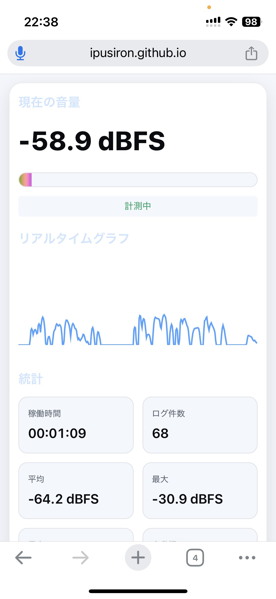

# Mic Gain Logger - マイク音量ロガー


[](https://ipusiron.github.io/mic-gain-logger/)

**Day041 - 生成AIで作るセキュリティツール100**

**Mic Gain Logger** は、調査員・探偵などが現場で利用することを想定した、Webブラウザーベースのマイク音量モニターツールです。

録音機能はあえて搭載せず、音の「存在」や「強さ」をリアルタイムで可視化・記録することに特化しています。

---

## 🌐 デモページ

👉 [https://ipusiron.github.io/mic-gain-logger/](https://ipusiron.github.io/mic-gain-logger/)

---

## 📸 スクリーンショット

>   
>
> *ダミー（iPhoneのSafariブラウザーでの利用例）*

---

## 🎯 主な機能
- **リアルタイム音量可視化**  
  Web Audio APIを用いて、マイク入力の音量（dBFS）を即時にグラフ化・数値表示。
- **統計情報の自動算出**  
  稼働時間、ログ件数、平均・最大・最小音量、変動幅を自動計算・表示。
- **録音なしのプライバシー配慮**  
  音声そのものは保存せず、音量データのみを扱うことで軽量かつプライバシー重視。
- **CSVログ出力**  
  タイムスタンプ付き音量データをCSVファイルとしてエクスポート可能。
- **リアルタイム設定変更**  
  ログ間隔（1s/3s/5s/10s/1mプリセット対応）、スムージング、表示下限は記録中でも変更可能で即座に反映。
- **データ累積記録**  
  「記録開始⇒停止⇒記録開始」を繰り返しても、統計とログデータは累積され続ける（「統計リセット」で手動クリア可能）。
- **マルチデバイス対応**  
  PC・タブレット・スマートフォンに最適化されたレスポンシブデザイン。
- **即起動・事前準備不要**  
  ページを開き、マイクアクセスを許可するだけで動作開始。インストール不要のWebアプリ。
- **直感的なユーザーインターフェイス**  
  大型数値表示・カラーメーター・リアルタイムグラフ・ヘルプ機能により、専門知識不要で利用可能。
- **ダークモード・ライトモード対応**  
  環境に応じてテーマを切り替え可能（設定は自動保存）。

---

## 🔒 セキュリティ的背景

本ツールは、セキュリティ分野における **物理的セキュリティ（Physical Security）** の一部として位置づけられます。
とくに、音響を対象とした監視・記録を行う **音響監視（Acoustic Surveillance）**／**技術的監視（Technical Surveillance）** のカテゴリに該当します。

現場の音環境をリアルタイムで可視化・記録することで、「会話や活動が発生しているか」の有無を把握するための支援ツールです。
探偵業務やセキュリティ調査、現場監視、証拠収集などの用途を想定しています。

## 👥 想定ターゲット層

### 🔍 プライマリーターゲット（主要利用者）
- **調査員・探偵**  
  浮気調査、企業調査、行動調査での音響証拠収集・現場監視。
- **セキュリティ専門家**  
  物理的セキュリティ監査、侵入検知システム設計での音響監視要素検証。
- **法執行機関関係者**  
  合法的な範囲内での音響環境監視・証拠保全作業。

### 🏢 セカンダリーターゲット（応用利用者）
- **施設管理者**  
  オフィス、店舗、工場等の音響環境モニタリング・騒音レベル把握。
- **研究者・学術関係者**  
  音響学研究、環境調査、行動分析での基礎データ収集。
- **技術者・エンジニア**  
  音響機器のテスト、キャリブレーション、デバッグ作業での簡易測定。

### 🎯 具体的な使用例・用途
- **現場調査**: 対象場所での活動有無の客観的記録
- **長時間監視**: 無人環境での音響変化検知・ログ記録  
- **証拠保全**: 法的手続きに必要な客観的音響データ作成
- **環境監査**: 騒音規制・労働環境基準との照合データ収集
- **機器検証**: マイク性能テスト・音響システム動作確認
- **会議室・オフィス**: 使用状況の把握、空室管理の効率化
- **店舗・商業施設**: 客足の動向分析、混雑時間帯の特定
- **工場・作業場**: 作業音レベルの監視、労働安全衛生管理
- **住宅・アパート**: 騒音問題の客観的記録・証拠収集
- **学校・教育機関**: 教室の騒音レベル測定、学習環境の評価
- **医療機関**: 静寂環境の維持確認、患者プライバシー保護
- **研究施設**: 実験環境の音響条件記録、データ品質管理

## 📋 具体的なシナリオ例

### シナリオ1: 浮気調査における証拠収集
**状況**: 探偵が依頼者の配偶者の行動を調査中。対象者が頻繁に訪れるカフェでの会話を音響レベルで記録したい。

**実行手順**:
1. カフェの座席でスマートフォンを使用してツールを起動
2. ログ間隔を **1秒** に設定（詳細な活動記録のため）
3. **記録開始** を押して、対象者の到着前から監視を開始
4. 対象者が到着し、会話が始まると音量レベルが上昇（-40dBFS → -20dBFS）
5. 会話終了後、音量が基準レベルに戻る（-50dBFS以下）
6. 3時間の監視後、**CSV書き出し** でタイムスタンプ付きデータを取得
7. 裁判資料として「対象時刻に音響活動があった」客観的証拠を提供

**メリット**: 録音なしでプライバシーに配慮しつつ、活動の有無を客観的に記録

---

### シナリオ2: オフィス騒音問題の定量的分析
**状況**: 企業の人事部が従業員から「隣の部署がうるさい」という苦情を受け、客観的なデータで状況を把握したい。

**実行手順**:
1. 苦情対象エリアにノートPCを設置してツールを起動
2. ログ間隔を **10秒** に設定（長時間監視でファイルサイズ抑制）
3. 1週間連続で **記録開始** → 終業時 **停止** → 翌朝 **記録開始** を繰り返し
4. 毎日のCSVデータから以下を分析:
   - 平均騒音レベル: **-35dBFS**（一般的なオフィス環境）
   - 最大騒音レベル: **-15dBFS**（会議中の活発な議論時）
   - 変動幅: **20dB**（静寂時と活動時の差）
5. 時間帯別の騒音パターンを可視化
6. 労働安全衛生基準と照合し、改善提案を作成

**成果**: 感情論ではなく定量的データに基づく環境改善策の立案

---

## 📂 ディレクトリー構成

```
mic-gain-logger/
├── index.html             # メインページ（レスポンシブ対応UI・ヘルプモーダル）
├── style.css              # スタイルシート（ダーク/ライトモード、モバイル最適化）
├── script.js              # アプリケーションロジック（音量取得・可視化・CSV出力・ヘルプ機能）
├── CLAUDE.md              # AI開発支援用ドキュメント（プロジェクト概要・開発ガイド）
├── TECHNICAL.md           # 技術実装解説（Web Audio API・Canvas・レスポンシブ設計）
├── assets/                # README.md用画像リソース
│   └── iphone_chrome.png  # メインスクリーンショット（iPhone Chromeでの表示例）
├── README.md              # プロジェクト説明書（機能・使用法・法的注意・トラブルシューティング）
└── LICENSE                # MITライセンス
```

---

## 📚 技術的な基礎知識

### dBFSとは？
**dBFS（decibels relative to Full Scale）** は、デジタル音響システムで使用される音量の単位です。

- **基準点**: デジタル系での最大音量を **0 dBFS** とする
- **表現範囲**: 通常 **-∞ dBFS** から **0 dBFS** までの負の値で表現
- **実用的な範囲**: 
  - **-60 dBFS以下**: ほぼ無音（環境ノイズレベル）
  - **-40 dBFS**: 静かな環境（図書館・深夜の住宅）
  - **-20 dBFS**: 一般的な会話・BGM
  - **-10 dBFS**: やや大きな音（活発な議論・音楽）
  - **0 dBFS**: デジタル上の最大音量（クリッピング直前）

**他の音量単位との違い**:
- **dB SPL（Sound Pressure Level）**: 物理的な音圧を表す（20μPa基準）
- **dBFS**: デジタル録音・処理システム内での相対的な音量レベル

本ツールでは **dBFS** を使用することで、使用デバイスに関係なく一貫した音量比較が可能になります。

---

## ⚖️ 重要な法的注意事項

### 🚨 利用時の法的制限について
本ツールは音量レベルのみを記録し録音機能はありませんが、**利用時は必ず適用される法律・規制を遵守してください**。

**日本国内での主な法的制限**:
- **刑法第133条（信書開封罪）**: 他人の会話を故意に傍受する行為は処罰対象
- **刑法第134条（秘密漏示罪）**: 職務上知り得た秘密を漏らす行為の禁止  
- **個人情報保護法**: 個人を識別可能な情報の取扱いに関する制限
- **探偵業法**: 探偵業務における適正な調査方法の義務付け
- **労働安全衛生法**: 職場での監視に関する労働者の同意と通知義務

**利用前の確認事項**:
- ✅ **同意の取得**: 監視対象者からの事前同意または法的根拠の確認
- ✅ **目的の正当性**: 調査・監視の目的が適法かつ必要最小限であること  
- ✅ **データ保護**: 取得したデータの適切な管理・保護・廃棄
- ✅ **専門家相談**: 法的判断が必要な場合は弁護士等への相談

### 🛡️ プライバシー保護の原則
- **最小限の原則**: 目的達成に必要最小限の情報のみを収集
- **透明性の確保**: 可能な限り監視の事実と目的を明示
- **データ最小化**: 不要になったデータの速やかな削除
- **第三者提供制限**: 正当な理由なく他者へのデータ提供禁止

---

## 🔧 トラブルシューティング

### よくある問題と解決方法

**❌ マイクダイアログが表示されない**
- **症状**: 「記録開始」を押してもマイクアクセス許可画面が出ない
- **解決策**: 
  1. ブラウザーのURL付近のマイクアイコン🎤をクリック
  2. 「このサイトで常に許可」を選択
  3. ページをリロード（F5キー）して再試行

**❌ 音量が「--.- dBFS」のままで変化しない**
- **症状**: マイクアクセスは許可されているが音量が計測されない
- **解決策**:
  1. マイクが正しく接続されているか確認
  2. システムの音量設定でマイクがミュートになっていないか確認
  3. 他のアプリケーションがマイクを占有していないか確認
  4. ブラウザーを再起動して再試行

**❌ 記録が自動的に停止する**
- **症状**: 放置していると記録が勝手に止まる
- **解決策**:
  1. ブラウザーのタブをアクティブ状態に維持
  2. 省電力モード・スリープモードを無効化
  3. ブラウザーの自動タブ停止機能を無効化

**❌ グラフが表示されない・崩れる**
- **症状**: リアルタイムグラフが真っ黒または変な表示
- **解決策**:
  1. ページをリロード（F5キー）
  2. ブラウザーのキャッシュをクリア
  3. 別のブラウザーで試行

**❌ スマートフォンで操作しにくい**
- **症状**: ボタンが小さい、レイアウトが崩れる
- **解決策**:
  1. 画面を縦向きにして使用
  2. ブラウザーのズーム機能で拡大
  3. 「設定を表示」ボタンで詳細設定を折りたたみ

### ブラウザー対応状況

| ブラウザー | デスクトップ | モバイル | 推奨度 | 備考 |
|------------|--------------|----------|--------|------|
| **Chrome** | ✅ 完全対応 | ✅ 完全対応 | ⭐⭐⭐ | もっとも安定 |
| **Firefox** | ✅ 完全対応 | ✅ 完全対応 | ⭐⭐⭐ | 高性能 |
| **Safari** | ✅ 完全対応 | ⚠️ 一部制限 | ⭐⭐☆ | iOS13+推奨 |
| **Edge** | ✅ 完全対応 | ✅ 完全対応 | ⭐⭐⭐ | Chrome同等 |
| **Opera** | ✅ 完全対応 | ✅ 完全対応 | ⭐⭐☆ | 問題なし |

**推奨動作環境**:
- **デスクトップ**: Windows 10+, macOS 10.15+, Ubuntu 18.04+
- **モバイル**: iOS 13+, Android 8.0+
- **RAM**: 最低2GB（長時間記録時は4GB以上推奨）

---

## 💡 将来的な追加アイデア
- **音量閾値トリガー**  
  設定したdB値を超えるとグラフにマーカーや警告表示を付与。
- **長時間稼働対応**  
  メモリ消費を抑えながら数時間〜一晩のログ記録が可能な設計。
- **ステルスモード**  
  UIを暗くして画面を目立たなくするモード。
- **キャリブレーション機能**  
  実測dB SPLに近づけるための補正値設定。

---

## 📊 CSVデータの活用方法

### Excel/Google Sheetsでの分析手順
1. **データインポート**: CSVファイルを開く際、「カンマ区切り」「UTF-8エンコーディング」を選択
2. **タイムスタンプ変換**: ISO形式の日時を認識させるため、該当列を「日時」形式に変更
3. **基本統計作成**:
   ```excel
   平均値: =AVERAGE(B:B)
   最大値: =MAX(B:B)
   最小値: =MIN(B:B)
   標準偏差: =STDEV(B:B)
   ```
4. **時系列グラフ作成**: A列（時間）をX軸、B列（dBFS値）をY軸として散布図を作成
5. **時間帯別分析**: 時刻別の平均値算出で活動パターンを可視化

### 推奨分析手法
- **移動平均**: 短期変動を平滑化して傾向を把握
- **閾値分析**: 設定レベル（例：-30dBFS）を超えた時間帯の特定
- **ピーク検出**: 急激な音量変化のタイミング抽出
- **頻度分布**: 各音量レベルの出現頻度をヒストグラムで表示

---

## 🌐 技術スタック
- **HTML / CSS / JavaScript**（VanillaJS）- フロントエンド基盤
- **Web Audio API** - 音声入力・リアルタイム分析
- **Canvas API** - リアルタイムグラフ描画
- **Blob API** - CSV出力・ファイルダウンロード
- **CSS Grid & Flexbox** - レスポンシブレイアウト
- **LocalStorage** - テーマ設定等の永続化

### 📖 技術実装の詳細解説
本ツールの技術的な実装について詳しく知りたい方は、以下のドキュメントをご覧ください：

**👉 [TECHNICAL.md - 技術実装解説](./TECHNICAL.md)**

このドキュメントでは以下の内容を詳しく解説しています：
- Web Audio APIの具体的な実装方法
- リアルタイムグラフ描画のアルゴリズム  
- レスポンシブデザインの実装戦略
- パフォーマンス最適化の手法
- エラーハンドリングとブラウザー互換性対策

---

## 📄 ライセンス

MIT License - 詳細は [LICENSE](LICENSE) をご覧ください。

---

## 🛠 このツールについて

本ツールは、「生成AIで作るセキュリティツール100」プロジェクトの一環として開発されました。  
このプロジェクトでは、AIの支援を活用しながら、セキュリティに関連するさまざまなツールを100日間にわたり制作・公開していく取り組みを行っています。

プロジェクトの詳細や他のツールについては、以下のページをご覧ください。

🔗 [https://akademeia.info/?page_id=42163](https://akademeia.info/?page_id=42163)
