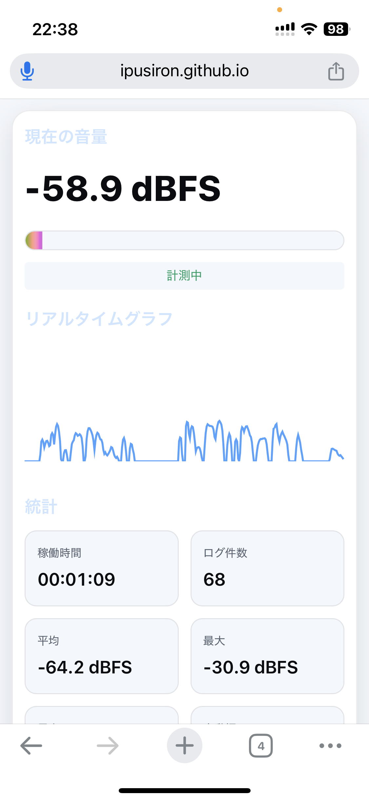

<!--
---
id: day041
slug: mic-gain-logger

title: "Mic Gain Logger"

subtitle_ja: "マイク音量ロガー"
subtitle_en: "Microphone Gain Logger"

description_ja: "録音せずにマイク入力の音量（dBFS）をリアルタイムで可視化・記録するWebツール。調査員・探偵などが現場で音響環境を監視するために設計。"
description_en: "A web-based tool that visualizes and logs microphone input levels (dBFS) in real-time without recording audio. Designed for investigators and security professionals to monitor acoustic environments in the field."

category_ja:
  - 物理セキュリティ
  - 音響監視
category_en:
  - Physical Security
  - Acoustic Surveillance

difficulty: 1

tags:
  - web-audio-api
  - microphone
  - dbfs
  - real-time
  - csv-export
  - privacy

repo_url: "https://github.com/ipusiron/mic-gain-logger"
demo_url: "https://ipusiron.github.io/mic-gain-logger/"

hub: true
---
-->

# Mic Gain Logger - マイク音量ロガー


[](https://ipusiron.github.io/mic-gain-logger/)

**Day041 - 生成AIで作るセキュリティツール100**

**Mic Gain Logger** は、調査員・探偵などが現場で利用することを想定した、Webブラウザーベースのマイク音量モニターツールです。

録音機能はあえて搭載せず、音の「存在」や「強さ」をリアルタイムで可視化・記録することに特化しています。

出力されるのはdBFSという相対値の時系列です。音圧（dB SPL）ではないため、規制値や基準値と並べて比べることはできません。できるのは「同じ端末・同じセッションの中で、音の活動が上がった／下がった」を時刻つきで残すところまでです。

---

## 🌐 デモページ

👉 [https://ipusiron.github.io/mic-gain-logger/](https://ipusiron.github.io/mic-gain-logger/)

---

## 📸 スクリーンショット

<a href="assets/iphone_chrome.png">
  
</a>

<sub>iPhoneのChromeでの利用例</sub>

---

## 🎯 主な機能
- **リアルタイム音量可視化**  
  Web Audio APIを用いて、マイク入力の音量（dBFS）を即時にグラフ化・数値表示。グラフの横軸は実時間（直近60秒）で、目盛りとラベルが入る。
- **欠測のない記録（AudioWorklet）**  
  区間の集計をオーディオスレッドで行うため、画面の描画が止まっても記録は続く。CSVの1行が1区間に対応する。AudioWorkletを読み込めない環境は**簡易モード**へ自動的に切り替わる。
- **統計情報の自動算出**  
  稼働時間、ログ件数、平均・最大・最小音量、変動幅を自動計算・表示。平均はエネルギー平均（Leqと同じ定義）で、母集団はCSVの行と一致する。
- **録音なしのプライバシー配慮**  
  音声そのものは保存せず、音量データのみを扱う。CSP（`connect-src 'none'`）により、外部への送信をブラウザーの機能として止めている。
- **CSVログ出力（v2）**  
  タイムスタンプ付き音量データに、区間の通し番号・ピーク・クリップ数・有効サンプル率・ハッシュを添えて書き出す。測定条件は`#`から始まるメタ行に残る。
- **改変の検出（ハッシュチェーン）**  
  各行のハッシュに前の行のハッシュを混ぜる。配布されたあとに第三者が行を消す・並べ替えると、値が合わなくなって検出できる。
- **無音も記録に残す**  
  デジタル無音は`-Infinity`として1行残す。行を落とさないので「活動がなかった」ことを示せる。
- **マイクの切断・時刻の跳びの検出**  
  記録中にマイクを失ったら記録を止め、何行目までが有効かを画面に出す。AudioContextの中断で時刻がずれた場合も検出して知らせる。
- **リアルタイム設定変更**  
  ログ間隔（1s/3s/5s/10s/1mプリセット対応）、スムージング、表示下限は記録中でも変更可能で即座に反映。表示下限は表示のための設定であり、記録される値は動かない。
- **データ累積記録**  
  「記録開始⇒停止⇒記録開始」を繰り返しても、統計とログデータは累積され続ける（「統計リセット」で手動クリア可能）。ただしログはブラウザーのメモリーにしかなく、タブを閉じると消える。
- **マルチデバイス対応**  
  PC・タブレット・スマートフォンの画面幅に合わせたレスポンシブデザイン（iOS・Androidの実機検証は未実施である）。
- **即起動・事前準備不要**  
  ページを開き、マイクアクセスを許可するだけで動作開始。インストール不要のWebアプリ。
- **直感的なユーザーインターフェイス**  
  大型数値表示・カラーメーター・リアルタイムグラフ・ヘルプ機能により、専門知識不要で利用可能。
- **ダークモード・ライトモード対応**  
  環境に応じてテーマを切り替え可能（設定は自動保存）。

---

## 🔬 計測の作りと実測値

### 計測エンジン

区間の集計はAudioWorklet（オーディオスレッド）で行います。128サンプルごとに必ず呼ばれるため、タブが背面に回って`requestAnimationFrame`が止まっても記録は続きます。区間の切れ目はオーディオクロックのフレーム番号で決めるので、区間長のずれが積み上がりません。描画は表示のためだけに行われます。

AudioWorkletを読み込めない環境（古いブラウザー、`file://`で直接開いた場合など）では**簡易モード**へ切り替わります。簡易モードは描画ループで記録するため、描画が止まると記録も止まります。どちらで動いているかは、画面上部の表示とCSVのメタ行`# engine=`（`worklet`／`fallback`／`mixed`）でわかります。

### 実測値

| 測ったこと | 改修前 | 改修後 |
|---|---|---|
| `requestAnimationFrame`を20秒止めたとき | 20.41秒の穴・19行が欠落 | 穴ゼロ |
| CPUを20倍にスロットルしたとき | 区間の86%が欠落 | 区間はきっかり設定どおり |
| AudioContextの中断 | 時刻が無言でずれる（10.05秒／20.03秒） | 検出して印を付け、アンカーを取り直す |
| 基準音に対するdBFSの計算精度 | 測っていない | ±0.0002dB |
| スマートフォン幅（320〜414px）での操作 | 設定UIが1つも開けない | 起動→ログ間隔1秒→記録→停止→CSVまで通る |

dBFSの±0.0002dBは「デジタルサンプルからdBFSを求める計算が正しい」ことを示す数字です。音の大きさを正しく測れていることを示すものではありません。詳しくは後述の「dBFSでできる比較・できない比較」をご覧ください。

---

## 🔒 セキュリティ的背景

本ツールは、セキュリティ分野における **物理的セキュリティ（Physical Security）** の一部として位置づけられます。
とくに、音響を対象とした監視・記録を行う **音響監視（Acoustic Surveillance）**／**技術的監視（Technical Surveillance）** のカテゴリに該当します。
ただし、計測器としては簡易なもので、検定を受けた騒音計の代わりにはなりません。

現場の音環境をリアルタイムで可視化・記録することで、「会話や活動が発生しているか」の有無を把握するための支援ツールです。
セキュリティ調査や現場の下見で、音の立ち上がりと静まりを時刻つきで残す用途を想定しています。
本ツールの出力は活動の有無を示す記録であって、音圧の測定値でも、手続きに使える証明でもありません。

## 👥 想定ターゲット層

### 🔍 プライマリーターゲット（主要利用者）
- **調査員・探偵**  
  浮気調査、企業調査、行動調査における、音響活動の時刻つき記録。
- **セキュリティ専門家**  
  物理的セキュリティ監査、侵入検知システム設計での音響監視要素検証。
- **法執行機関関係者**  
  合法的な範囲内での音響環境モニタリング、および活動時刻の記録。

### 🏢 セカンダリーターゲット（応用利用者）
- **施設管理者**  
  オフィス、店舗、工場等で、音の活動が集中する時間帯の把握。
- **研究者・学術関係者**  
  音響学研究、環境調査、行動分析での基礎データ収集。
- **技術者・エンジニア**  
  音響機器のテスト、動作確認、デバッグ作業での相対的な確認。

### 🎯 想定する使い方（本ツールの出力でできること・できないこと）

本ツールが出すのはdBFSという相対値の時系列です。音圧（dB SPL）ではないため、規制値や基準値と並べて比べることはできません。できるのは「同じ端末・同じセッションの中で、音の活動が上がった／下がった」を時刻つきで残すところまでです。以下の用途は、この前提の上で読んでください。

- **現場調査**: 対象場所で音の活動があったかどうかの時刻つき記録
- **長時間監視**: 無人環境での音の変化の検知・ログ記録
- **活動時刻の記録**: 「いつ音の活動があったか」を時刻つきで残す。改変・並べ替え・部分削除は、CSVのハッシュチェーンで後から検出できる
- **環境の変化の把握**: 同じ場所・同じ端末で、時間帯によって音の活動がどう変わるかを見る。規制値や基準値と比べる用途には使えない（理由は次節）
- **機器検証**: マイクの動作確認・音響システムの疎通確認
- **会議室・オフィス**: 使用状況の把握、空室管理の効率化
- **店舗・商業施設**: 客足の動向分析、混雑時間帯の特定
- **工場・作業場**: 作業音の時間帯ごとの変化の把握（労働安全衛生法上の作業環境測定の代わりにはならない）
- **住宅・アパート**: 騒音が起きた時間帯の記録（音圧の測定値ではない）
- **学校・教育機関**: 教室が静かな時間帯・騒がしい時間帯の把握（騒音レベルの測定ではない）
- **医療機関**: 静寂環境の維持確認、患者プライバシー保護
- **研究施設**: 実験環境の音響条件の記録、データ品質管理

### 🚫 規制値・基準値とは比較できない

本ツールが出すのはdBFSという相対値です。騒音規制法の規制基準も、職場の騒音の基準値（85dB・90dB）も、20μPaを基準としたA特性音圧レベル（dB SPL）で定義されています。dBFSからdB SPLへは、マイクの感度とプリアンプの利得が分からなければ変換できません。本ツールはブラウザーからそれらを取得できないため、変換していません。

制度の側でも、使える計量器が限定されています。

- 騒音計は計量法上の「特定計量器」である（計量法施行令 第2条第15号）。検定に合格した証印のないものは、取引または証明における計量に使用できない（計量法 第16条第1項）
- 騒音規制法の規制基準の測定については、告示が「計量法第七十一条の条件に合格した騒音計を用いて行うものとする。この場合において、周波数補正回路はA特性を、動特性は速い動特性（FAST）を用いることとする」と定めている（特定工場等において発生する騒音の規制に関する基準 備考3）
- 職場の騒音については、作業環境測定基準（昭和51年労働省告示第46号）第4条が「測定に用いる機器（以下「騒音計」という。）は、等価騒音レベルを測定できるものであること」「騒音計の周波数補正回路のA特性で行うこと」と定めている。個人ばく露測定では、JIS C1509-1またはIEC 61252に規定する精度を満たす機器が求められる（騒音障害防止のためのガイドライン 別紙3）

本ツールはA特性の重み付けを持たず、検定も受けていません。**規制値・基準値と比べたい場合は、検定を受けた騒音計を使うか、計量証明の事業者に依頼してください。**

（確認日2026-09-28。出典はe-Gov法令検索 https://laws.e-gov.go.jp/ 、環境省 https://www.env.go.jp/hourei/07/000052.html 、厚生労働省 https://www.mhlw.go.jp/content/001089239.pdf である）

## 📋 具体的なシナリオ例

### シナリオ1: 浮気調査における活動時刻の記録
**状況**: 探偵が依頼者の配偶者の行動を調査中。対象者が頻繁に訪れるカフェで、会話があった時間帯を音量の変化として残したい。

**実行手順**:
1. カフェの座席でスマートフォンを使用してツールを起動
2. ログ間隔を **1秒** に設定（詳細な活動記録のため）
3. **記録開始** を押して、対象者の到着前から監視を開始
4. 対象者が到着し、会話が始まると音量レベルが上昇する（値の動きは端末によって違う。たとえば-40dBFS付近から-20dBFS付近へ、といった具合だが、この数字は例であって実測値ではない）
5. 会話終了後、音量が元の水準に戻る
6. 3時間の監視を終えたら **停止** を押し、そのあと **CSV書き出し** でタイムスタンプ付きデータを取得する（⚠**記録中は書き出しボタンが押せない。**書き出しは停止後に行う）
7. 「対象時刻に音響活動があった／なかった」を時刻つきの記録として残す。本ツールの出力は検定を受けた騒音計による測定ではないため、そのまま手続きの証明には使えない。必要な場合は、専門家に扱い方を確認する

**メリット**: 録音なしでプライバシーに配慮しつつ、活動の有無を時刻つきで残せる

**確認済みの動作環境**: 画面幅320〜414px、CPU4倍／20倍のスロットル、画面ロック相当の状態のいずれでも、この手順（起動→ログ間隔1秒→記録→停止→CSV）が通ることを実測で確認した。

---

### シナリオ2: オフィスの音の活動が集中する時間帯を洗い出す
**状況**: 企業の人事部が従業員から「隣の部署がうるさい」という苦情を受け、いつ音の活動が集中しているのかを把握したい。

**実行手順**:
1. 苦情対象エリアにノートPCを設置してツールを起動する。記録の全期間で同じ端末・同じマイクを使う（途中で替えると値が比較できなくなる）
2. ログ間隔を **10秒** に設定（長時間監視でファイルサイズ抑制）
3. 毎朝 **記録開始** → 終業時 **停止** → **CSV書き出し** までを1日の区切りとして回す。⚠**ログはブラウザーのメモリーにしかない。**タブを閉じる、リロードする、ブラウザーが落ちる、OSがタブを破棄する、のいずれかが起きるとそれまでの記録は全部消える。その日のぶんを書き出すまでタブを閉じない
4. 毎日のCSVデータから以下を読む:
   - 平均（Leq）・最大・最小・変動幅。⚠**これらはdBFSであり、この端末でのみ意味を持つ値である。**「一般的なオフィスは何dBFS」という比較には使えない
   - 時間帯ごとの行の分布。静かな時間帯と騒がしい時間帯の差
5. 時間帯別のパターンを可視化する
6. どの時間帯に音の活動が集中しているかを特定し、席の配置や会議の時間帯の見直しにつなげる。なお本ツールの値はdBFSであり、労働安全衛生の基準値（A特性音圧レベル85dB等）と比べることはできない。基準値との比較が必要な場合は、作業環境測定の専門家に依頼する

**成果**: 印象ではなく記録に基づいて、音の活動が集中する時間帯を特定できる

---

## 📂 ディレクトリー構成

```
mic-gain-logger/
├── index.html                     # メインページ（UI・ヘルプモーダル・CSPの宣言）
├── style.css                      # スタイルシート（ダーク/ライトモード・モバイル最適化）
├── script.js                      # DOMとブラウザーAPI（マイク取得・描画・CSV書き出し）
├── logic.js                       # 純ロジック（dBFS換算・区間・統計・グラフ座標・CSV組み立て）
├── worklet/                       # オーディオスレッドで動くコード
│   └── meter-processor.js         # AudioWorkletProcessor（区間ごとの集計）
├── test/                          # テスト（node:test・依存パッケージなし）
│   ├── logic.test.js              # 段階0: 純関数（clamp・dBFS換算・時刻整形ほか）
│   ├── interval.test.js           # 段階1: 「1行＝1区間」の組み立て
│   ├── meter-processor.test.js    # 段階1: ワークレット本体をnode:vmの中で動かす
│   ├── clock.test.js              # 段階2-1: AudioContextの中断による時刻のずれ
│   ├── silence.test.js            # 段階2-2: デジタル無音を記録に残す
│   ├── device.test.js             # 段階2-3: マイクのデバイス喪失の検出
│   ├── connect.test.js            # 段階2-4: マイク取得のタイムアウトと取り消し
│   ├── meta.test.js               # 段階2-5: 測定条件のメタデータ
│   ├── css.test.js                # 段階3-1: セレクターの記述順（スマートフォンの設定UI）
│   ├── canvas.test.js             # 段階3-2: キャンバスの大きさ（RangeError・px焼き込み・横はみ出し）
│   ├── graph.test.js              # 段階3-3: 横軸の実時間化・目盛りとラベル
│   ├── stats-csv.test.js          # 段階3-4: 画面の統計とCSVから再計算した統計の一致
│   ├── contrast.test.js           # 段階3-6: 両テーマのコントラスト比
│   ├── cleanup.test.js            # 段階3-7: 死にコード・入力フォント・タッチターゲット
│   ├── hashchain.test.js          # 段階4-1: ハッシュチェーン
│   ├── dbfs-fixture.test.js       # 既知振幅の正弦波に対するdBFSの計算精度
│   ├── docs.test.js               # READMEと実装・実ファイルの照合（この構成図を含む）
│   └── fixtures/                  # テストの期待値
│       └── expected_dbfs.json     # 既知振幅の正弦波から作った期待dBFS
├── assets/                        # README.md用の画像
│   └── iphone_chrome.png          # スクリーンショット（iPhone Chromeでの表示例）
├── .github/                       # GitHubの設定
│   └── workflows/                 # GitHub Actionsのワークフロー
│       └── test.yml               # CI（pushとpull requestで npm test を走らせる）
├── package.json                   # npm test の定義（依存パッケージなし）
├── .gitignore                     # Gitの除外設定
├── CLAUDE.md                      # 開発ガイド（ファイルの役割分担・計測の要点・CSVの約束）
├── README.md                      # プロジェクト説明書（本ファイル）
└── LICENSE                        # MITライセンス
```

---

## 📚 技術的な基礎知識

### dBFSとは？
**dBFS（decibels relative to Full Scale）** は、デジタル音響システムで使用される音量の単位です。

- **基準点**: デジタル系での最大音量を **0 dBFS** とする
- **表現範囲**: 通常 **-∞ dBFS** から **0 dBFS** までの負の値で表現
- **実用的な範囲**: 以下の目安は、一般的なノートPCの内蔵マイクで手元の環境を測ったときの感覚値である。マイクが違えば10dB以上ずれるため、絶対的な基準としては使えない
  - **-60 dBFS以下**: ほぼ無音（環境ノイズレベル）
  - **-40 dBFS**: 静かな環境（図書館・深夜の住宅）
  - **-20 dBFS**: 一般的な会話・BGM
  - **-10 dBFS**: やや大きな音（活発な議論・音楽）
  - **0 dBFS**: デジタル上の最大音量（クリッピング直前）

### dBFSでできる比較・できない比較

dBFSは、そのデジタル系で表せる最大振幅を0 dBFSとしたときの相対値です。0 dBFSが何Paの音圧に当たるかは、マイクの感度、プリアンプの利得、OS側のミキサーの設定、自動ゲイン調整（AGC）の有無で変わります。本ツールはブラウザーからこれらの絶対値を取得できないため、dBFSをdB SPLへ変換できません。

したがって、**同じ音を別の端末で測れば、別のdBFS値が出ます。**メーカーの違うマイクどうしはもちろん、同じ端末でも外付けマイクを挿し替えれば値は変わります。

言えるのは、次の範囲までです。

- **同一端末・同一セッション内の相対比較**である。記録中にマイクを替えず、OSの入力音量も動かしていなければ、「いまの音は3分前より12dB大きい」は正しく読める
- **セッションをまたぐ比較は、測定条件がそろっている場合に限られる。**本ツールはCSVのメタ行に、デバイス名・サンプルレート・`getSettings()`が返した実際の値（AGC・ノイズ抑制・エコーキャンセルの適用状態）を書き出す。この3つが一致していれば、同じ端末の別セッションどうしは比較できる。1つでも違えば比較できない
- **絶対的な音の大きさは出せない。**「-35 dBFSだったから静かなオフィスである」とは言えない。マイクの感度が10dB違えば、同じオフィスで-25 dBFSにも-45 dBFSにもなる

なお、dBFSの計算そのものの精度は基準音に対して±0.0002dBです。これは「デジタルサンプルからdBFSを求める計算が正しい」ことを示す数字であって、「音の大きさを正しく測れている」ことを示す数字ではありません。この2つは別の話です。

### 他の音量単位との違い

| 単位 | 基準 | 何を表すか |
|---|---|---|
| dB SPL | 20μPa（人の可聴閾に由来する固定値） | 物理的な音圧。騒音規制や労働環境の基準値はこちら |
| dBFS | そのデジタル系の最大振幅 | デジタル系の中での相対的な信号レベル。端末ごとに基準が違う |

---

## ⚖️ 利用上の注意（法的な助言ではありません）

本ツールは音量レベルだけを記録し、音声そのものは録音しません。それでも、他人の生活空間や職場の音を継続して記録する行為には、法的な制約がかかることがあります。何が問題になるかは、記録の目的、機器を置いた場所、記録した期間、記録を誰に見せるかによって変わります。

以下は、2026-09-28時点でe-Gov法令検索の原文にあたって確認できた範囲だけを書いたものです。本ドキュメントは、特定の法令が当てはまるかどうかを判断するものではありません。

### 原文で確認できた事項

- **本ツールの出力は、取引や証明の用途には使えない。**騒音計は計量法上の「特定計量器」である（計量法施行令 第2条第15号）。検定に合格した証印のない特定計量器、および計量器でないものは、取引または証明における計量に使用してはならず、使用に供するために所持することもできない（計量法 第16条第1項）。違反には罰則がある（同法 第172条第1号）。計量法第2条第2項は「証明」を「公に又は業務上他人に一定の事実が真実である旨を表明すること」と定義している
- **騒音規制法の規制基準と比べるには、検定に合格した騒音計が要る。**規制基準の測定方法を定めた告示は、使用する計量器を「計量法第七十一条の条件に合格した騒音計」に限定し、周波数補正回路はA特性、動特性は速い動特性（FAST）を用いることとしている（特定工場等において発生する騒音の規制に関する基準・昭和43年厚生省・農林省・通商産業省・運輸省告示第1号 備考3）
- **職場の騒音の基準値は、A特性音圧レベルの等価騒音レベルである。**測定方法は作業環境測定基準（昭和51年労働省告示第46号）第4条が定め、「測定に用いる機器（以下「騒音計」という。）は、等価騒音レベルを測定できるものであること」「騒音計の周波数補正回路のA特性で行うこと」としている
- **業として他人の所在・行動を調べる営業には、届出義務がある。**探偵業の業務の適正化に関する法律 第4条第1項。同法第6条は「この法律により他の法令において禁止又は制限されている行為を行うことができることとなるものではないことに留意するとともに、人の生活の平穏を害する等個人の権利利益を侵害することがないようにしなければならない」と定める。届出をしても、記録行為そのものが適法になるわけではない

### 過去の版にあった誤りの訂正

本READMEは以前、刑法第133条・第134条・労働安全衛生法を「日本国内での主な法的制限」として挙げていました。原文にあたった結果、次のとおり誤りであることがわかったため撤回します。

- 刑法第133条は「正当な理由がないのに、封をしてある信書を開けた者」を対象とする信書開封罪である。会話や音の傍受を対象とする文言はない
- 刑法第134条の秘密漏示罪は、医師・薬剤師・医薬品販売業者・助産師・弁護士・弁護人・公証人（およびこれらの職にあった者）と、宗教・祈祷・祭祀の職にある者に主体が限られる身分犯である。ツールの利用者一般には当たらない
- 労働安全衛生法の全文を検索したところ、「盗聴」「録音」「音響」はいずれも0件だった。「監視」は第22条第3号の「計器監視、精密工作等の作業による健康障害」の1件のみで、職場での監視について労働者の同意や通知を義務づけた条文は見つからなかった

### 使う前に確かめてほしいこと

- 記録をとる場所に立ち入る権限があるか
- 記録をとることについて、対象となる人の同意があるか、または同意に代わる正当な根拠があるか
- 取得したデータを目的の範囲にとどめ、不要になったら削除できる状態か
- その記録を第三者へ出す予定があるなら、出してよいものかどうかを事前に確認したか

### 運用の原則（法令の話ではなく、実務上の心構えである）

- **最小限の原則**: 目的の達成に必要な範囲だけを記録する
- **透明性の確保**: 可能な限り、記録している事実と目的を明らかにする
- **データ最小化**: 不要になった記録は速やかに削除する
- **第三者提供の制限**: 正当な理由なく他者へ渡さない

### ここに書いていないこと

上の列挙は、当てはまる可能性のある法令を網羅したものではありません。民事上のプライバシー侵害、記録する場所への立ち入り、個人情報の取扱い、地方公共団体の条例などは、ここでは検討していません。実際に使う前に弁護士等の専門家へご確認ください。

（確認日2026-09-28。出典はe-Gov法令検索 https://laws.e-gov.go.jp/ 、環境省 https://www.env.go.jp/hourei/07/000052.html 、厚生労働省 https://www.mhlw.go.jp/content/001089239.pdf である）

---

## 🔧 トラブルシューティング

### よくある問題と解決方法

**❌ マイクダイアログが表示されない**
- **症状**: 「記録開始」を押してもマイクアクセス許可画面が出ない
- **解決策**: 
  1. ブラウザーのURL付近のマイクアイコン🎤をクリック
  2. 「このサイトで常に許可」を選択
  3. ページをリロード（F5キー）して再試行

**❌ 音量が「--.- dBFS」のままで変化しない**
- **症状**: マイクアクセスは許可されているが音量が計測されない
- **解決策**:
  1. マイクが正しく接続されているか確認
  2. システムの音量設定でマイクがミュートになっていないか確認
  3. 他のアプリケーションがマイクを占有していないか確認
  4. ブラウザーを再起動して再試行

**❌ 記録が自動的に停止する**
- **症状**: 放置していると記録が勝手に止まる
- **解決策**:
  1. 画面上部の計測エンジンの表示を見る。「簡易モード」と出ている場合、描画が止まると記録も止まる。HTTPSで開き直すとAudioWorkletが使える
  2. 「マイクが切断されました」と出ている場合は、記録中にデバイスを失っている。何行目までが有効かはその場に出る（そこまでのログは書き出せる）
  3. 省電力モード・スリープモードを無効化する
  4. ブラウザーの自動タブ停止機能を無効化する。⚠**タブが破棄されるとログは全部消える。**長時間記録では、こまめにCSVへ書き出しておく

**❌ 「計測エンジン: 簡易モード（欠測の可能性あり）」と出る**
- **症状**: 高精度モードにならない
- **原因**: AudioWorkletのモジュール（`worklet/meter-processor.js`）を読み込めていない
- **解決策**:
  1. `file://`で直接開いていないか確認する。ローカルで試すなら`python -m http.server 8000`などでHTTP経由にする
  2. ブラウザーがAudioWorkletに対応しているか確認する

**❌ CSVの`hash`列が空になる**
- **症状**: ハッシュチェーンの値が出ない
- **原因**: `crypto.subtle`は安全なコンテキスト（httpsまたはlocalhost）でしか使えない
- **解決策**: HTTPSまたはlocalhost経由で開き直す

**❌ 「マイクを20秒以内に取得できませんでした」と出る**
- **症状**: 記録開始を押したあと、待たされて失敗する
- **原因**: マイクの許可プロンプトが放置されている（改修前はここでUIが固まっていた）
- **解決策**: 許可プロンプトに応答してから、もう一度記録開始を押す

**❌ グラフが表示されない・崩れる**
- **症状**: リアルタイムグラフが真っ黒または変な表示
- **解決策**:
  1. ページをリロード（F5キー）
  2. ブラウザーのキャッシュをクリア
  3. 別のブラウザーで試行

**❌ スマートフォンで操作しにくい**
- **症状**: ボタンが小さい、レイアウトが崩れる
- **解決策**:
  1. 画面を縦向きにして使用
  2. ブラウザーのズーム機能で拡大
  3. 「設定を表示」ボタンで詳細設定を折りたたみ

### ブラウザー対応状況

⚠**iOS・Androidの実機では検証していません。**モバイル幅での確認は、デスクトップのChromium（Playwright）で幅320〜414px・CPU4倍/20倍のスロットル・画面ロック相当の状態を作って行ったものである。実機での挙動（とくにiOS Safariの`AudioContext`の扱いとバックグラウンドでの停止）は確かめていない。

| ブラウザー | デスクトップ | モバイル | 備考 |
|---|---|---|---|
| **Chrome / Edge**（Chromium） | ✅ 実測で確認 | ⚠️ エミュレーションのみ | 本READMEの実測値はすべてChromiumで採った |
| **Firefox** | ⚠️ 未検証 | ⚠️ 未検証 | Web Audio APIとAudioWorkletには対応しているが、実機では確かめていない |
| **Safari** | ⚠️ 未検証 | ⚠️ 未検証 | iOS 13+が必要。iOS Safariは実機検証が要る筆頭である |
| **Opera** | ⚠️ 未検証 | ⚠️ 未検証 | Chromium系なので同等と見込まれるが、確かめていない |

AudioWorkletが使えない環境では簡易モードへ切り替わります。簡易モードでも記録はできますが、画面の描画が止まると記録も止まります。

**動作の前提**:
- **HTTPS（またはlocalhost）**: `getUserMedia`と`crypto.subtle`がどちらも安全なコンテキストを要求する。`file://`で開くとマイクが使えず、ハッシュ列も空になる
- **デスクトップ**: Windows 10+, macOS 10.15+, Ubuntu 18.04+
- **モバイル**: iOS 13+, Android 8.0+
- **メモリー**: ログはすべてブラウザーのメモリーに載る。ログ間隔1秒で24時間回すと86,400行になる

---

## 💡 将来的な追加アイデア
- **音量閾値トリガー**  
  設定したdB値を超えるとグラフにマーカーや警告表示を付与。
- **長時間稼働対応**  
  ログをIndexedDB等へ逃がし、タブが落ちても失わない設計（現状はすべてメモリー上にある）。
- **A特性の重み付け**  
  現状は重み付けなし（CSVの`weighting=Z`）。A特性を入れれば、値の相対変化を人の聴覚に近づけられる。
- **ステルスモード**  
  UIを暗くして画面を目立たなくするモード。
- **キャリブレーション機能**  
  実測dB SPLに近づけるための補正値設定。

---

## 📊 CSVデータの活用方法

### CSVの形式（v2）

`#`で始まる行は測定条件のメタ行です。そのあとにヘッダー行とデータ行が続きます。

```
# format=mic-gain-logger/2
# engine=worklet
# started=2026-09-28T09:00:01.000Z
# sampleRate=48000
# intervalSec=1
# device=MacBook Proのマイク
# processing=off
# weighting=Z
# hash=sha-256-chain-16
timestamp,dbfs,seq,peak_dbfs,clip,valid_ratio,hash
2026-09-28T09:00:01.000Z,-42.13,1,-38.20,0,1.000,3f1a2b4c5d6e7f80
```

列の意味は以下のとおりである。

| 列 | 意味 |
|---|---|
| `timestamp` | 区間の終わりの時刻（ISO 8601・UTC） |
| `dbfs` | 区間のエネルギー平均（生値）。デジタル無音は`-Infinity` |
| `seq` | 区間の通し番号。欠番があれば行が抜けている |
| `peak_dbfs` | 区間内のピーク |
| `clip` | 0 dBFSに張り付いたサンプルの数 |
| `valid_ratio` | その区間で実際に集計できたサンプルの割合。1.000を下回っていればレンダークォンタムを落としている |
| `hash` | ハッシュチェーンの値（SHA-256の先頭16文字） |

⚠**A列が時刻、B列が音量であることは変わっていません。**後述のExcelの手順（`=AVERAGE(B:B)`など）はそのまま使えます。新しい列は右へ足す方針なので、今後もこの2列は動かしません。

メタ行の意味は以下のとおりである。

| キー | 意味 |
|---|---|
| `format` | CSVの版（`mic-gain-logger/2`） |
| `engine` | `worklet`（AudioWorklet）／`fallback`（簡易モード）／`mixed`（1つのCSVに両方が混ざっている） |
| `started` | 最初の区間の時刻 |
| `sampleRate` | AudioContextのサンプルレート |
| `intervalSec` | ログ間隔（秒） |
| `device` | マイクのデバイス名 |
| `processing` | マイク側の音の加工（AGC・ノイズ抑制・エコーキャンセル）の適用状態。`off`なら加工なし |
| `weighting` | 周波数の重み付け。本ツールは重み付けをしないので常に`Z` |
| `hash` | ハッシュチェーンの方式 |
| `silence` | 無音の書き方。無音を含む記録にだけ付く（`-Infinity`） |

### ⚠ CSVを人に渡す前に中身を確かめる

メタ行の`# device=`には、マイクのデバイス名がそのまま入ります。**機器名に利用者の名前が含まれていることがあります**（「〇〇のAirPods」など）。渡す前にこの行を開いて確認し、必要なら削ってください。

ただし、ハッシュチェーンの起点はメタ行そのものです。メタ行を書き換えると、ハッシュの再計算は通らなくなります。

### 改変の検出（ハッシュチェーン）

各行のハッシュは「前の行のハッシュ＋その行のデータ」から計算します。したがって、配布されたあとに**第三者が行を消す・並べ替える・書き換える**と、それ以降のハッシュが合わなくなり、検出できます。`seq`の欠番も、これとは別の手がかりになります。

⚠**これは「改ざんを防ぐ」ものではありません。**ログを作った本人はチェーンごと作り直せるので、提出者自身が疑われる場面（自分で採ったログを自分で提出する、など）では何も主張できません。守れるのは、手を離れたあとの第三者による改変の検出だけです。

なお、ハッシュは`crypto.subtle`が使える安全なコンテキスト（httpsまたはlocalhost）でしか計算できません。`file://`で直接開いた場合、`hash`列は空になります。

### Excel/Google Sheetsでの分析手順
1. **データインポート**: CSVファイルを開く際、「カンマ区切り」「UTF-8エンコーディング」を選択
2. **タイムスタンプ変換**: ISO形式の日時を認識させるため、該当列を「日時」形式に変更
3. **基本統計作成**:
   ```excel
   平均値: =AVERAGE(B:B)
   最大値: =MAX(B:B)
   最小値: =MIN(B:B)
   標準偏差: =STDEV(B:B)
   ```
4. **時系列グラフ作成**: A列（時間）をX軸、B列（dBFS値）をY軸として散布図を作成
5. **時間帯別分析**: 時刻別の平均値算出で活動パターンを可視化

### 推奨分析手法
- **移動平均**: 短期変動を平滑化して傾向を把握
- **閾値分析**: 設定レベル（例：-30dBFS）を超えた時間帯の特定
- **ピーク検出**: 急激な音量変化のタイミング抽出
- **頻度分布**: 各音量レベルの出現頻度をヒストグラムで表示

---

## 🌐 技術スタック
- **HTML / CSS / JavaScript**（VanillaJS・ビルド工程なし）- フロントエンド基盤
- **Web Audio API / AudioWorklet** - 音声入力・オーディオスレッドでの区間集計
- **Canvas API** - リアルタイムグラフ描画
- **Web Crypto API**（`crypto.subtle`）- ハッシュチェーンのSHA-256
- **Blob API** - CSV出力・ファイルダウンロード
- **CSS Grid & Flexbox** - レスポンシブレイアウト
- **LocalStorage** - テーマ設定等の永続化
- **Content Security Policy** - `connect-src 'none'`で外部への送信を遮断
- **node:test** - 依存パッケージなしのテスト（`npm test`）

### 📖 実装の詳細を読むには

技術解説の別ドキュメントは置いていません。「なぜそう書いたか」は、コードのコメントとテストに書いてあります。

| 知りたいこと | 読む場所 |
|---|---|
| 区間の切り方（1行＝1区間） | `worklet/meter-processor.js`、`logic.js`の「区間」の節、`test/interval.test.js` |
| dBFSの求め方と統計（Leq） | `logic.js`の「統計」の節、`test/dbfs-fixture.test.js`・`test/stats-csv.test.js` |
| 時刻のアンカーと取り直し | `logic.js`の「時刻のアンカー」の節、`test/clock.test.js` |
| デジタル無音・デバイス喪失 | `logic.js`の「デジタル無音の扱い」「マイクのデバイス喪失」の節、`test/silence.test.js`・`test/device.test.js` |
| 測定条件のメタデータ | `logic.js`の「測定条件」の節、`test/meta.test.js` |
| CSV v2 とハッシュチェーン | `logic.js`の「CSV」の節、`test/hashchain.test.js` |
| グラフの座標・目盛り・キャンバス | `logic.js`の「グラフ」「キャンバスの大きさ」の節、`test/graph.test.js`・`test/canvas.test.js` |
| 開発時の約束ごと（どのファイルに何を書くか） | [CLAUDE.md](./CLAUDE.md) |

テストは`npm test`で実行します（依存パッケージなし・Node.js 22以上）。

### 参考資料

- [MDN Web Audio API](https://developer.mozilla.org/ja/docs/Web/API/Web_Audio_API)
- [MDN AudioWorklet](https://developer.mozilla.org/ja/docs/Web/API/AudioWorklet)
- [W3C Web Audio API Specification](https://www.w3.org/TR/webaudio/)
- [MDN Canvas API](https://developer.mozilla.org/ja/docs/Web/API/Canvas_API)
- [MDN SubtleCrypto](https://developer.mozilla.org/ja/docs/Web/API/SubtleCrypto)
- [dBFS - Wikipedia](https://en.wikipedia.org/wiki/DBFS)

---

## 📄 ライセンス

MIT License - 詳細は [LICENSE](LICENSE) をご覧ください。

---

## 🛠 このツールについて

本ツールは、「生成AIで作るセキュリティツール100」プロジェクトの一環として開発されました。  
このプロジェクトでは、AIの支援を活用しながら、セキュリティに関連するさまざまなツールを100日間にわたり制作・公開していく取り組みを行っています。

プロジェクトの詳細や他のツールについては、以下のページをご覧ください。

🔗 [https://akademeia.info/?page_id=42163](https://akademeia.info/?page_id=42163)
