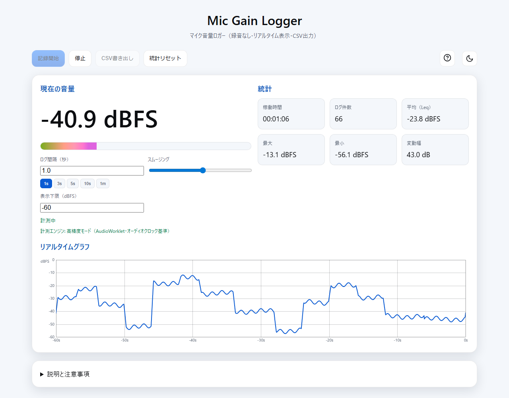
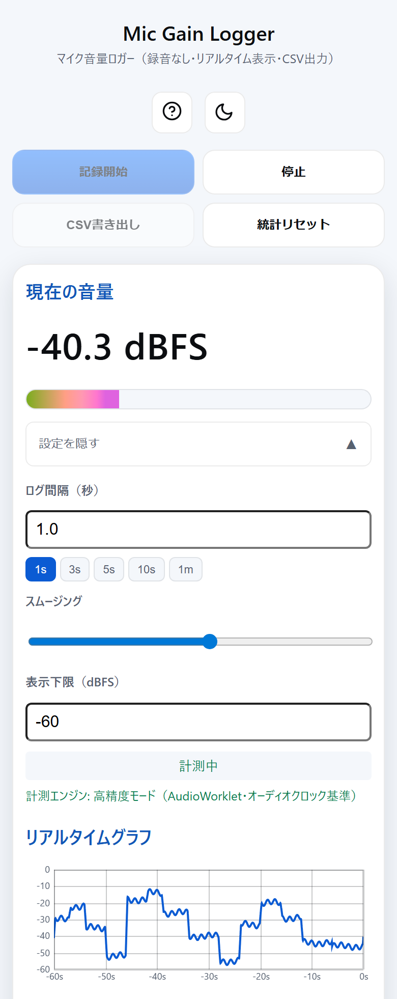
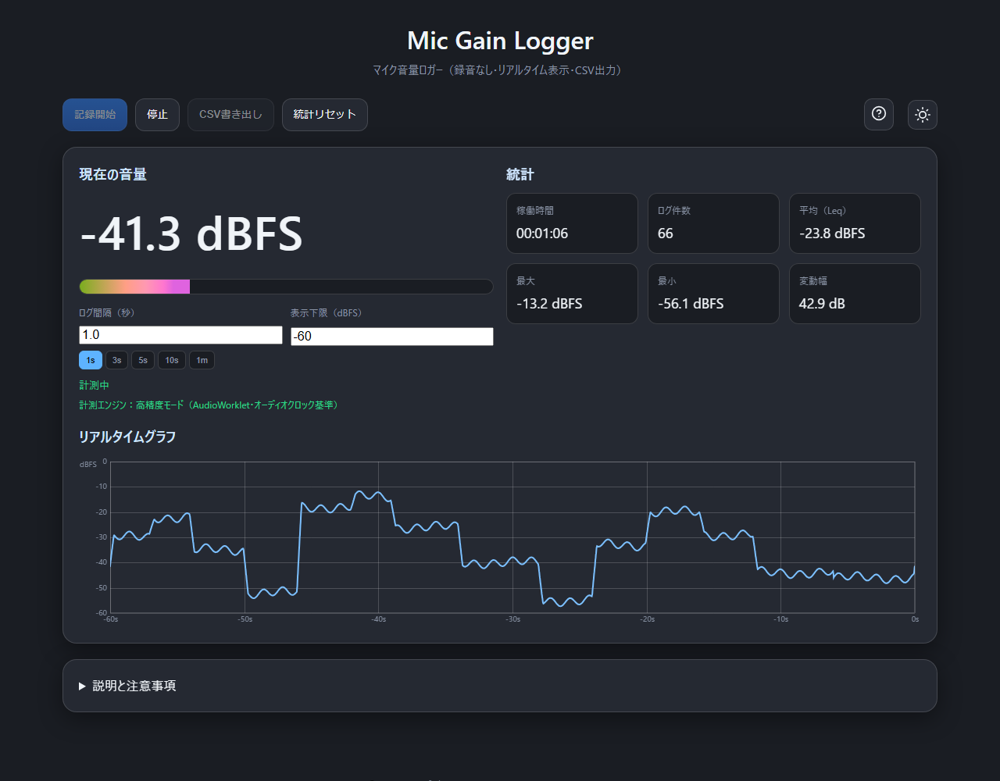

<!--
---
id: day041
slug: mic-gain-logger

title: "Mic Gain Logger"

subtitle_ja: "マイク音量ロガー"
subtitle_en: "Microphone Gain Logger"

description_ja: "マイク入力の音量（dBFS）を、録音せずに区間ごとに記録し続けるWebツール。描画が止まっても穴のあかない時系列を、ハッシュチェーン付きのCSVへ書き出す。dBFSは端末ごとの相対値であり、音圧（dB SPL）ではない。"
description_en: "A browser tool that logs microphone input level (dBFS) interval by interval without recording any audio. The measurement runs in an AudioWorklet, so the log keeps no gaps even when rendering stalls, and each CSV row carries a hash chained to the previous row. dBFS is relative to each device full scale, not sound pressure (dB SPL)."

category_ja:
  - 物理セキュリティ
  - 音響監視
category_en:
  - Physical Security
  - Acoustic Surveillance

difficulty: 3

tags:
  - web-audio-api
  - microphone
  - dbfs
  - real-time
  - csv-export
  - privacy

repo_url: "https://github.com/ipusiron/mic-gain-logger"
demo_url: "https://ipusiron.github.io/mic-gain-logger/"

hub: true
---
-->

# Mic Gain Logger - マイク音量ロガー


[](https://ipusiron.github.io/mic-gain-logger/)

**Day041 - 生成AIで作るセキュリティツール100**

**Mic Gain Logger** は、マイク入力の音量（dBFS）を録音せずに記録し続けるWebブラウザーベースのツールです。

録音機能はあえて搭載せず、音の「存在」や「強さ」をリアルタイムで可視化・記録することに特化しています。

出力されるのはdBFSという相対値の時系列です。音圧（dB SPL）ではないため、規制値や基準値と並べて比べることはできません。できるのは「同じ端末・同じセッションの中で、音の活動が上がった／下がった」を時刻つきで残すところまでです。

---

## 🌐 デモページ

👉 [https://ipusiron.github.io/mic-gain-logger/](https://ipusiron.github.io/mic-gain-logger/)

---

## 📸 スクリーンショット

<a href="assets/screenshot.png">
  
</a>

<sub>記録中の画面。計測エンジン・実時間の横軸・統計が1枚に入る</sub>

<a href="assets/screenshot2.png">
  
</a>

<sub>スマートフォン幅（390px）で設定を開いたところ</sub>

<a href="assets/screenshot3.png">
  
</a>

<sub>ダークテーマでの表示</sub>

<sub>いずれも疑似マイクにテスト信号を流して撮ったものです。実際のマイクでは値が変わります。スマートフォン幅の画面はブラウザーの画面幅を390pxにしたもので、実機ではありません。</sub>

---

## 🎯 主な機能
- **リアルタイム音量可視化**  
  Web Audio APIを用いて、マイク入力の音量（dBFS）を即時にグラフ化・数値表示。グラフの横軸は実時間（直近60秒）で、目盛りとラベルが入る。折れ線はCSVに記録される区間そのものを描くので、画面の描画が止まってもグラフに穴があかない。記録していない時間と、音が1つも届かなかった区間（欠測）は線をつながず、デジタル無音の区間は下端に張り付く。超音波帯（18〜22kHz）の値を破線で重ね、凡例はグラフの下に置く（色と線の形の両方で見分けられる）。⚠**画面の大きな数字は直近2048サンプル（48kHzで約43ミリ秒。サンプルレートで変わる）の全帯域のRMSで、高精度モードのCSVの`dbfs`（区間全体のエネルギー平均）とは窓が違う。**ときどき大きくなる音（扇風機のうなり・洗濯機など）では、エネルギー平均が大きな瞬間に引っぱられるので、大きな数字のほうがCSVの値より低く見える時間が長くなる。簡易モードでは、CSVの`dbfs`も記録した瞬間のこの窓の値である。
- **超音波帯（18〜22kHz）の記録と表示**  
  区間ごとに、超音波帯（18,000〜22,000Hz）と可聴帯（20〜18,000Hz）のエネルギーを記録する（CSVの帯域の列）。画面では、超音波帯の値をグラフの破線と統計の「超音波帯の最大」に出す。大きな数字の下には「超音波帯（直近1秒の区間）：-91.7 dBFS」のように、最後に記録した区間の値（CSVの`band_ultra_dbfs`と同じ。区間の長さはログ間隔）を数字で出す。大きな数字とは窓も帯域も違う。数dBの小さな変化はグラフでは読みにくいので、この数字で読む。最初の区間が届くまでは`--.- dBFS`、値の無い区間では「（この区間は値なし）」、`?bands=off`・簡易モード・超音波帯を測れないサンプルレートでは値の代わりに理由が出る。⚠**帯域の値は「その帯域に音のエネルギーがあったか」の記録で、何の音かは分からない。**超音波帯の値が無い区間（簡易モード・`?bands=off`・計算に使えるフレームが無い区間）は破線を切る。凡例の下には、記録を始めると「この端末で記録できる上限：約◯◯kHz」が出る。AudioContextとマイクの音声トラックのサンプルレートの、小さいほうの半分である（トラックが報告しないときはAudioContextの半分で、「トラックの値は不明」と添える）。サンプルレートで決まる上限で、マイクがその高さの音を拾えることは示さない。注意書きには、帯域の有効率（`band_valid_ratio`）が1.0を下回った区間の件数と最小値、マイクとAudioContextのサンプルレートの食い違い（変換で、上限に近い高い音が低く記録される）、超音波帯を測れないサンプルレート、`?bands=off`で帯域の計算を止めていること、簡易モードで帯域を計算していないこと、を出す。`?bands=off`を付けて開くと帯域の計算を止め（帯域あり・なしで有効サンプル率を比べるためのもの）、凡例と注意書きに「止めています」と出る。超音波帯の線を描かないとき（`?bands=off`・簡易モード・超音波帯を測れないサンプルレート）は、凡例の見本の線を隠し、描かない理由を出す。
- **欠測のない記録（AudioWorklet）**  
  区間の集計をオーディオスレッドで行うため、画面の描画が止まっても記録は続く。CSVの1行が1区間に対応する。AudioWorkletを読み込めない環境は**簡易モード**へ自動的に切り替わる。
- **統計情報の自動算出**  
  稼働時間、ログ件数、平均・最大・最小音量、変動幅、サンプルピーク、超音波帯の最大を自動計算・表示。平均はエネルギー平均（Leqと同じ定義）で、母集団はCSVの行と一致する（音が1つも届かなかった区間＝`dbfs`が空欄の行は除く）。**平均の重みは行数ではなく区間長（秒）である。**ログ間隔は記録中に変えられるため、1秒の区間と3秒の区間を同じ重みで平均すると実時間に比例しない値が出る。CSVから同じ値を出す手順は後述の「Excel/Google Sheetsでの分析手順」にある。⭐**停止→再開の境界では、`timestamp`の差に休止時間がまるごと入る。**その行（トレーラーの`# sessionStartAt=`）だけは差を使わず、`# intervalSec=`のログ間隔を重みにする。「超音波帯の最大」は`band_ultra_dbfs`の最大で、デジタル無音の行に付いた帯域の値も数える（後述の「帯域の列」）。簡易モードと`?bands=off`では測れないため`--.-`のままになる。
- **記録の穴の有無を、両側で表示**  
  クリップした区間があれば区間の数と延べサンプル数を、有効サンプル率が1.0を下回った区間があれば件数と最小値を、その場で画面に出す。**クリップは単発と連続を言い分ける。**3サンプル以上続いた区間は波形がつぶれて値が本来の音と違い、1〜2サンプルの単発なら区間の値への影響は小さい。記録した全サンプルに対する割合も出す（延べの数だけでは大ごとに見えるため）。⭐**穴が無いときも「記録の穴なし（クリップ0区間／有効サンプル率は10区間すべて1.000）」と出す。**片側だけ出すと、記録がきれいなときに画面が何も言わないので、利用者は「穴が無い」と「まだ調べていない」を区別できない。簡易モードの行はどちらも測れないため、その区間数を添えて「測れません」と出す。
- **録音なしのプライバシー配慮**  
  音声そのものは保存せず、音量データのみを扱う。CSP（`connect-src 'none'`）により、外部への送信をブラウザーの機能として止めている。
- **CSVログ出力（v3）**  
  タイムスタンプ付き音量データに、区間の通し番号・ピーク・クリップ数・有効サンプル率・帯域の値（超音波帯18,000〜22,000Hzと可聴帯20〜18,000Hz）・ハッシュを添えて書き出す。帯域の値は「その帯域に音のエネルギーがあったか」の記録で、何の音かは分からない。測定条件は`#`から始まるメタ行に残る。
- **破損・欠落の検出（ハッシュチェーン）**  
  各行のハッシュに前の行のハッシュを混ぜる。**CSVがそのまま渡ってきたときに、うっかりの破損・部分的な欠落・順序の入れ替わりを見つけられる。**⚠**意図的な改変には、相手が誰であっても耐えない**（鎖の作り方を公開しているので、書き換えたあとに計算し直せば検証は通る。後述の「ハッシュチェーンで何が分かるか」を参照）。
- **無音も記録に残す**  
  デジタル無音は`-Infinity`として1行残す。行を落とさないので「活動がなかった」ことを示せる。音が1つも届かなかった区間（欠測）は、`dbfs`を空欄にして無音と分ける。
- **マイクの切断・時刻の跳びの検出**  
  記録中にマイクを失ったら記録を止め、何行目までが有効かを画面に出す。供給元で無音化された場合（通話の割り込みなど）とAudioContextの中断で時刻がずれた場合も、その場で画面に出す。
- **測定条件の記録と警告**  
  マイク側の音の加工（AGC・ノイズ抑制・エコーキャンセル）を無効で要求したうえで、実際にどうなったかを`getSettings()`の実値で確かめる。加工が有効なままなら「この記録のdBFSは絶対値として扱えない」と画面に出す。デバイス名・サンプルレート・加工の状態はCSVのメタ行にも残る。
- **マイク取得の取り消し**  
  許可ダイアログを放置しても画面は固まらない。20秒で時間切れになり、接続中でも「停止」でその場で取り消せる。
- **リアルタイム設定変更**  
  ログ間隔（1s/3s/5s/10s/1mプリセット対応）と表示下限は記録中でも変更可能で即座に反映。表示下限は表示のための設定であり、記録される値は動かない。表示下限の既定は-110dBFSで、`?bands=off`で開いたときは-90dBFSである。静かな部屋の超音波帯は-90dBFSより低いことがあり、既定が-90では超音波帯の破線が下端に張り付いたため。
- **データ累積記録**  
  「記録開始⇒停止⇒記録開始」を繰り返しても、統計とログデータは累積され続ける（「統計リセット」で手動クリア可能。記録を停止してから押せ、ログ・統計・グラフ・注意書きをまとめて消す）。ただしログはブラウザーのメモリーにしかなく、タブを閉じると消える。
- **マルチデバイス対応**  
  PC・タブレット・スマートフォンの画面幅に合わせたレスポンシブデザイン（実機で確かめたのはiPhone 18 Pro Maxの1台だけで、Androidは確かめていない。詳しくは後述の「ブラウザー対応状況」）。記録開始と停止は同じ場所に出し、そのとき押せるほうだけを見せる（マイクに接続中は「停止」で取り消せる）。幅480px以下では「CSV書き出し」と「統計リセット」を「その他」にまとめ、記録開始／停止・「その他」・ヘルプ・テーマの切り替えを1行に並べる（「その他」はEscキーでも閉じられる）。
- **即起動・事前準備不要**  
  ページを開き、マイクアクセスを許可するだけで動作開始。インストール不要のWebアプリ。
- **直感的なユーザーインターフェイス**  
  大型数値表示・カラーメーター・リアルタイムグラフ・ヘルプ機能により、専門知識不要で利用可能。
- **ダークモード・ライトモード対応**  
  環境に応じてテーマを切り替え可能（設定は自動保存）。

---

## 🔬 計測の作りと実測値

### 計測エンジン

区間の集計はAudioWorklet（オーディオスレッド）で行います。128サンプルごとに必ず呼ばれるため、タブが背面に回って`requestAnimationFrame`が止まっても記録は続きます。区間の切れ目はオーディオクロックのフレーム番号で決めるので、区間長のずれが積み上がりません。描画は表示のためだけに行われます。

AudioWorkletを読み込めない環境（古いブラウザー、`file://`で直接開いた場合など）では**簡易モード**へ切り替わります。簡易モードは描画ループで記録するため、描画が止まると記録も止まります。どちらで動いているかは、画面上部の表示とCSVのヘッダー`# engine=`でわかります（記録中にモードが変わった場合は、トレーラーに`# engines=worklet+fallback`が付きます）。

### 実測値

| 測ったこと | 改修前 | 改修後 |
|---|---|---|
| `requestAnimationFrame`を20秒止めたとき | 20.41秒の穴・19行が欠落 | 穴ゼロ |
| CPUを20倍にスロットルしたとき | 区間の86%が欠落 | 区間はきっかり設定どおり |
| AudioContextの中断 | 時刻が無言でずれる（10.05秒／20.03秒） | 検出してCSVのトレーラー行に残し、アンカーを取り直す |
| 基準音に対するdBFSの計算精度 | 測っていない | ±0.0002dB |
| スマートフォン幅（320〜414px）での操作 | 設定UIが1つも開けない | 起動→ログ間隔1秒→記録→停止→CSVまで通る |

dBFSの±0.0002dBは「デジタルサンプルからdBFSを求める計算が正しい」ことを示す数字です。音の大きさを正しく測れていることを示すものではありません。詳しくは後述の「dBFSでできる比較・できない比較」をご覧ください。

⚠**いずれもデスクトップのChromium（Playwright）で採った値です。**最後の行の「スマートフォン幅」は画面幅を320〜414pxにしたもので、実機ではありません。検証の範囲は後述の「ブラウザー対応状況」に1か所まとめてあります。

### 外した設定（スムージング）

以前あった「スムージング」のスライダーは外しました。この設定が動かしていたのは`AnalyserNode.smoothingTimeConstant`だけで、これは周波数領域の値にしか作用しません。本ツールの計測は時間領域のRMSなので、**表示にも記録にも一切反映されていませんでした**。音の揺れをならす扱いは、この先の弾で時間重み（Fast=125ms／Slow=1s）として入れ直します。⚠**入れ直すのは表示までです。**区間のLeqは区間の完全な要約なので、時間重みをかけても区間の平均は変わりません。記録に追加で載せられるのは、区間内のLFmax／LSmaxまでです。

---

## 🔒 セキュリティ的背景

本ツールは、セキュリティ分野における **物理的セキュリティ（Physical Security）** の一部として位置づけられます。
とくに、音響を対象とした監視・記録を行う **音響監視（Acoustic Surveillance）**／**技術的監視（Technical Surveillance）** のカテゴリに該当します。
ただし、計測器としては簡易なもので、検定を受けた騒音計の代わりにはなりません。

現場の音環境をリアルタイムで可視化・記録することで、「会話や活動が発生しているか」の有無を把握するための支援ツールです。
セキュリティ調査や現場の下見で、音の立ち上がりと静まりを時刻つきで残す用途を想定しています。
本ツールの出力は活動の有無を示す記録であって、音圧の測定値でも、手続きに使える証明でもありません。

## 👥 想定ターゲット層

本ツールが残すのは、dBFSという端末ごとの相対値の時系列です。その記録が役に立つのは、次のような場面です。

### 🔍 プライマリーターゲット（主要利用者）
- **自分がいる場所の音を記録として残したい人**  
  自室・作業場・自宅で、音の活動が上がった時刻と静まった時刻を残す。出るのは端末ごとの相対値であって、音の大きさを表す値ではない。
- **技術者・エンジニア**  
  マイクの疎通確認、音響機器のテスト、入力レベルの相対的な確認。
- **Web Audio APIの実装を読みたい開発者**  
  AudioWorkletで区間を落とさずに集計する書き方、区間長で重み付けしたLeq、ハッシュチェーン付きCSVの組み立て方を、コードとテストで追える。

### 🏢 セカンダリーターゲット（応用利用者）
- **施設管理者**  
  オフィス、店舗、工場等で、音の活動が集中する時間帯の把握。
- **研究者・学術関係者**  
  音響・環境・行動を調べる前段の下見。検定を受けた機器による本測定の代わりにはならない。
- **セキュリティの学習者**  
  鍵も外部のアンカーも持たないハッシュチェーンで、何が分かって何が分からないかを、動くもので確かめる。分かるのは破損・欠落・入れ替わりまでで、意図的な改変には耐えない。自分で鎖を張り直してみると、その境目がわかる。

### 🎯 想定する使い方（本ツールの出力でできること・できないこと）

本ツールが出すのはdBFSという相対値の時系列です。音圧（dB SPL）ではないため、規制値や基準値と並べて比べることはできません。できるのは「同じ端末・同じセッションの中で、音の活動が上がった／下がった」を時刻つきで残すところまでです。以下の用途は、この前提の上で読んでください。

- **現場調査**：対象場所で音の活動があったかどうかの時刻つき記録
- **長時間監視**：無人環境での音の変化の検知・ログ記録
- **活動時刻の記録**：「いつ音の活動があったか」を時刻つきで残す。転送中の破損・部分的な欠落・順序の入れ替わりは、CSVのハッシュチェーンで後から気づける（意図的な改変の証明には使えない）
- **環境の変化の把握**：同じ場所・同じ端末で、時間帯によって音の活動がどう変わるかを見る。規制値や基準値と比べる用途には使えない（理由は次節）
- **機器検証**：マイクの動作確認・音響システムの疎通確認
- **会議室・オフィス**：使用状況の把握、空室管理の効率化
- **店舗・商業施設**：客足の動向分析、混雑時間帯の特定
- **工場・作業場**：作業音の時間帯ごとの変化の把握（労働安全衛生法上の作業環境測定の代わりにはならない）
- **住宅・アパート**：騒音が起きた時間帯の記録（音圧の測定値ではない）
- **学校・教育機関**：教室が静かな時間帯・騒がしい時間帯の把握（騒音レベルの測定ではない）
- **医療機関**：静寂環境の維持確認、患者プライバシー保護
- **研究施設**：実験環境の音響条件の記録、データ品質管理

### 🚫 規制値・基準値とは比較できない

本ツールが出すのはdBFSという相対値です。騒音規制法の規制基準も、職場の騒音の基準値（85dB・90dB）も、20μPaを基準としたA特性音圧レベル（dB SPL）で定義されています。dBFSからdB SPLへは、マイクの感度とプリアンプの利得がわからなければ変換できません。本ツールはブラウザーからそれらを取得できないため、変換していません。

制度の側でも、使える計量器が限定されています。

- 騒音計は計量法上の「特定計量器」である（計量法施行令 第2条第15号）。検定に合格した証印のないものは、取引または証明における計量に使用できない（計量法 第16条第1項）
- 騒音規制法の規制基準の測定については、告示が「計量法第七十一条の条件に合格した騒音計を用いて行うものとする。この場合において、周波数補正回路はA特性を、動特性は速い動特性（FAST）を用いることとする」と定めている（特定工場等において発生する騒音の規制に関する基準 備考3）
- 職場の騒音については、作業環境測定基準（昭和51年労働省告示第46号）第4条が「測定に用いる機器（以下「騒音計」という。）は、等価騒音レベルを測定できるものであること」「騒音計の周波数補正回路のA特性で行うこと」と定めている。個人ばく露測定では、JIS C1509-1またはIEC 61252に規定する精度を満たす機器が求められる（騒音障害防止のためのガイドライン 別紙3）

本ツールはA特性の重み付けを持たず、検定も受けていません。**規制値・基準値と比べたい場合は、検定を受けた騒音計を使うか、計量証明の事業者に依頼してください。**

（確認日2026-09-28。出典はe-Gov法令検索 https://laws.e-gov.go.jp/ 、環境省 https://www.env.go.jp/hourei/07/000052.html 、厚生労働省 https://www.mhlw.go.jp/content/001089239.pdf です）

## 📋 具体的なシナリオ例

### シナリオ1：浮気調査における活動時刻の記録
**状況**：探偵が依頼者の配偶者の行動を調査中。対象者が頻繁に訪れるカフェで、会話があった時間帯を音量の変化として残したい。

**実行手順**
1. カフェの座席でスマートフォンを使用してツールを起動
2. ログ間隔を **1秒** に設定（詳細な活動記録のため）
3. **記録開始** を押して、対象者の到着前から監視を開始
4. 対象者が到着し、会話が始まると音量レベルが上昇する（値の動きは端末によって違う。たとえば-40dBFS付近から-20dBFS付近へ、といった具合だが、この数字は例であって実測値ではない）
5. 会話終了後、音量が元の水準に戻る
6. 3時間の監視を終えたら **停止** を押し、そのあと **CSV書き出し** でタイムスタンプ付きデータを取得する（⚠**記録中は書き出しボタンが押せない。**書き出しは停止後に行う）
7. 「対象時刻に音響活動があった／なかった」を時刻つきの記録として残す。本ツールの出力は検定を受けた騒音計による測定ではないため、そのまま手続きの証明には使えない。必要な場合は、専門家に扱い方を確認する

**メリット**：録音なしでプライバシーに配慮しつつ、活動の有無を時刻つきで残せる

**確認した範囲**：この手順（起動→ログ間隔1秒→記録→停止→CSV）が通ることは、デスクトップのChromium（Playwright）で画面幅320〜414px・CPU4倍／20倍のスロットル・画面ロック相当の状態を作って確かめた。iPhone 18 Pro Max（iOS Safari）の実機でも、起動→記録→停止→CSV書き出しが通り、書き出したCSVが後述の検証器を通ることを確かめた（2026-09-29、1台のみ。公開版c7b6badで確認）。⚠**実機の画面ロック中・バックグラウンドでの挙動は確かめていない。**画面ロックはブラウザーのエミュレーションで作ったものであって、実機の挙動（とくにiOS Safariの`AudioContext`の扱いとバックグラウンドでの停止）とは別である。検証の範囲は後述の「ブラウザー対応状況」に1か所まとめてあるので、そちらを見てほしい。

---

### シナリオ2：オフィスの音の活動が集中する時間帯を洗い出す
**状況**：企業の人事部が従業員から「隣の部署がうるさい」という苦情を受け、いつ音の活動が集中しているのかを把握したい。

**実行手順**
1. 苦情対象エリアにノートPCを設置してツールを起動する。記録の全期間で同じ端末・同じマイクを使う（途中で替えると値が比較できなくなる）
2. ログ間隔を **10秒** に設定（長時間監視でファイルサイズ抑制）
3. 毎朝 **記録開始** → 終業時 **停止** → **CSV書き出し** → **統計リセット** までを1日の区切りとして回す。⚠**「統計リセット」を押さないと、ログは前日ぶんに積み上がったまま残る。**このツールは記録開始のたびにログを累積する作りなので、押し忘れると翌日のCSVに前日の行が混ざる。⚠**ログはブラウザーのメモリーにしかない。**タブを閉じる、リロードする、ブラウザーが落ちる、OSがタブを破棄する、のいずれかが起きるとそれまでの記録は全部消える。その日のぶんを書き出すまでタブを閉じない
4. 毎日のCSVデータから以下を読む
   - 平均（Leq）・最大・最小・変動幅。⚠**これらはdBFSであり、この端末でのみ意味を持つ値である。**「一般的なオフィスは何dBFS」という比較には使えない
   - 時間帯ごとの行の分布。静かな時間帯と騒がしい時間帯の差
5. 時間帯別のパターンを可視化する
6. どの時間帯に音の活動が集中しているかを特定し、席の配置や会議の時間帯の見直しにつなげる。なお本ツールの値はdBFSであり、労働安全衛生の基準値（A特性音圧レベル85dB等）と比べることはできない。基準値との比較が必要な場合は、作業環境測定の専門家に依頼する

**成果**：印象ではなく記録に基づいて、音の活動が集中する時間帯を特定できる

---

## 📂 ディレクトリー構成

```
mic-gain-logger/
├── index.html                     # メインページ（UI・ヘルプモーダル・CSPの宣言）
├── style.css                      # スタイルシート（ダーク/ライトモード・モバイル最適化）
├── script.js                      # DOMとブラウザーAPI（マイク取得・描画・CSV書き出し）
├── logic.js                       # 純ロジック（dBFS換算・区間・統計・グラフ座標・CSV組み立て）
├── worklet/                       # オーディオスレッドで動くコード
│   └── meter-processor.js         # AudioWorkletProcessor（区間ごとの集計）
├── test/                          # テスト（node:test・依存パッケージなし）
│   ├── logic.test.js              # 段階0: 純関数（clamp・dBFS換算・時刻整形ほか）
│   ├── interval.test.js           # 段階1: 「1行＝1区間」の組み立て
│   ├── meter-processor.test.js    # 段階1: ワークレット本体をnode:vmの中で動かす
│   ├── clock.test.js              # 段階2-1: AudioContextの中断による時刻のずれ
│   ├── silence.test.js            # 段階2-2: デジタル無音を記録に残す
│   ├── device.test.js             # 段階2-3: マイクのデバイス喪失の検出
│   ├── connect.test.js            # 段階2-4: マイク取得のタイムアウトと取り消し
│   ├── meta.test.js               # 段階2-5: 測定条件のメタデータ
│   ├── css.test.js                # 段階3-1: セレクターの記述順（スマートフォンの設定UI）
│   ├── canvas.test.js             # 段階3-2: キャンバスの大きさ（RangeError・pxの直書き・横はみ出し）
│   ├── graph.test.js              # 段階3-3: 横軸の実時間化・目盛りとラベル
│   ├── stats-csv.test.js          # 段階3-4: 画面の統計とCSVから再計算した統計の一致
│   ├── contrast.test.js           # 段階3-6: 両テーマのコントラスト比
│   ├── cleanup.test.js            # 段階3-7: 死にコード・入力フォント・タッチターゲット
│   ├── hashchain.test.js          # 段階4-1: ハッシュチェーン（起点・トレーラー・欠落と入れ替わりの検出）
│   ├── chain-runner.test.js       # 段階4-2: 記録中に鎖を進める入れ物（非同期の状態機械）
│   ├── chain-claim.test.js        # 公開前の直し: 鎖の名乗りと、表の値が実測と合っているか
│   ├── smoothing.test.js          # 第1弾の締め: 効かなかったスムージング設定の廃止
│   ├── stats-weight.test.js       # 公開前の直し: 統計（Leq）を区間長で重み付けする
│   ├── stats-notice.test.js       # 公開前の直し: ピーク・クリップ・有効サンプル率と記録の穴の表示
│   ├── interval-label.test.js     # 公開前の直し: 行に貼るログ間隔を実測の区間長にする
│   ├── session-weight.test.js     # 公開前の直し: 停止→再開をまたいで重みを取る手順と検算値
│   ├── reset.test.js              # 第2弾a: 統計リセットで母集団（ログ・統計・グラフ・注意書き）をまとめて捨てる
│   ├── processing-label.test.js   # 第2弾a: メタ行の processing を off／active／unknown の3値で書く
│   ├── clip-notice.test.js        # 第2弾a: クリップの注意書き（分母・単発と連続）とサンプルピークの呼び方
│   ├── css-order.test.js          # 第2弾a: 幅で切り替える規則が後ろの素の規則に打ち消されていないか
│   ├── meter-floor.test.js        # 第2弾a・c: メーターの目盛りを見えるようにし、表示下限の既定を-90dBFSに（第2弾cで帯域ありは-110dBFSに）
│   ├── notice-details.test.js     # 第2弾a: 注意書きを「件数と要点の1行＋開くと全文」にする
│   ├── review-ui.test.js          # 第2弾a: 公開前の点検で見つかった画面の不具合（停止中のグラフ・目盛り・ボタンの高さ）
│   ├── fft.test.js                # 第2弾b: FFTの土台（素朴なDFTとの一致・片側スペクトルの正規化・配列を作らない約束）
│   ├── band.test.js               # 第2弾b: 区間ごとの帯域の集計（ビンの割り当て・75%の重なり・途切れ・1行目の帯域の有効率）
│   ├── csv-v3.test.js             # 第2弾b: CSV v3（帯域の3列・ヘッダーの約束・欠測の空欄化・v2とv3を1本の手順で検証）
│   ├── band-ui.test.js            # 第2弾b: 画面の帯域（超音波帯の破線・欠測で線を切る・超音波帯の最大・注意書き・記録できる上限）
│   ├── mobile-view.test.js        # 第2弾c: スマートフォンのファーストビュー（記録開始と停止を1つの場所に・「その他」・dvh）
│   ├── ultra-now.test.js          # 第2弾c: 超音波帯の現在値と、画面の大きな数字とCSVの値の窓の違い
│   ├── dbfs-fixture.test.js       # 既知振幅の正弦波に対するdBFSの計算精度
│   ├── docs.test.js               # READMEと実装・実ファイルが合っているかの検査（構成図を含む）
│   └── fixtures/                  # テストの期待値
│       ├── expected_dbfs.json     # 既知振幅の正弦波から作った期待dBFS
│       └── sample_v2.csv          # 第2弾aまでのREADMEに載せていた見本CSV（v2・7列。検証器がv2も通すことの確認用）
├── assets/                        # ファビコンとREADME.md用の画像
│   ├── favicon.svg                # ファビコン（レベルメーターの棒。外部への取得は発生しない）
│   ├── screenshot.png             # 記録中の画面（ライトテーマ）
│   ├── screenshot2.png            # スマートフォン幅で設定を開いた画面
│   └── screenshot3.png            # 記録中の画面（ダークテーマ）
├── .github/                       # GitHubの設定
│   └── workflows/                 # GitHub Actionsのワークフロー
│       └── test.yml               # CI（pushとpull requestでnpm testを実行する）
├── package.json                   # npm testの定義（依存パッケージなし）
├── .nojekyll                      # GitHub PagesでJekyll処理を無効化（空ファイル）
├── .gitignore                     # Gitの除外設定
├── CLAUDE.md                      # 開発ガイド（ファイルの役割分担・計測の要点・CSVの約束）
├── README.md                      # プロジェクト説明書（本ファイル）
└── LICENSE                        # MITライセンス
```

---

## 📚 技術的な基礎知識

### dBFSとは？
**dBFS（decibels relative to Full Scale）** は、デジタル音響システムで使用される音量の単位です。

- **基準点**：デジタル系での最大音量を **0 dBFS** とする
- **表現範囲**：通常 **-∞ dBFS** から **0 dBFS** までの負の値で表現
- **実用的な範囲**：以下の目安は、一般的なノートPCの内蔵マイクで手元の環境を測ったときの感覚値である。マイクが違えば10dB以上ずれるため、絶対的な基準としては使えない
  - **-60 dBFS以下**：ほぼ無音（環境ノイズレベル）
  - **-40 dBFS**：静かな環境（図書館・深夜の住宅）
  - **-20 dBFS**：一般的な会話・BGM
  - **-10 dBFS**：やや大きな音（活発な議論・音楽）
  - **0 dBFS**：デジタル上の最大音量（クリッピング直前）

### dBFSでできる比較・できない比較

dBFSは、そのデジタル系で表せる最大振幅を0 dBFSとしたときの相対値です。0 dBFSが何Paの音圧に当たるかは、マイクの感度、プリアンプの利得、OS側のミキサーの設定、自動ゲイン調整（AGC）の有無で変わります。本ツールはブラウザーからこれらの絶対値を取得できないため、dBFSをdB SPLへ変換できません。

したがって、**同じ音を別の端末で測れば、別のdBFS値が出ます。**メーカーの違うマイクどうしはもちろん、同じ端末でも外付けマイクを挿し替えれば値は変わります。

言えるのは、次の範囲までです。

- **同一端末・同一セッション内の相対比較**である。記録中にマイクを替えず、OSの入力音量も動かしていなければ、「いまの音は3分前より12dB大きい」は正しく読める
- **セッションをまたぐ比較は、測定条件がそろっている場合に限られる。**本ツールはCSVのメタ行に、デバイス名・サンプルレート・`getSettings()`が返した実際の値（AGC・ノイズ抑制・エコーキャンセルの適用状態）を書き出す。この3つが一致していれば、同じ端末の別セッションどうしは比較できる。1つでも違えば比較できない
- **絶対的な音の大きさは出せない。**「-35 dBFSだったから静かなオフィスである」とは言えない。マイクの感度が10dB違えば、同じオフィスで-25 dBFSにも-45 dBFSにもなる

なお、dBFSの計算そのものの精度は基準音に対して±0.0002dBです。これは「デジタルサンプルからdBFSを求める計算が正しい」ことを示す数字であって、「音の大きさを正しく測れている」ことを示す数字ではありません。この2つは別の話です。

### ほかの音量単位との違い

| 単位 | 基準 | 何を表すか |
|---|---|---|
| dB SPL | 20μPa（人の可聴閾に由来する固定値） | 物理的な音圧。騒音規制や労働環境の基準値はこちら |
| dBFS | そのデジタル系の最大振幅 | デジタル系の中での相対的な信号レベル。端末ごとに基準が違う |

---

## ⚖️ 利用上の注意（法的な助言ではありません）

本ツールは音量レベルだけを記録し、音声そのものは録音しません。それでも、他人の生活空間や職場の音を継続して記録する行為には、法的な制約がかかることがあります。何が問題になるかは、記録の目的、機器を置いた場所、記録した期間、記録を誰に見せるかによって変わります。

以下は、2026-09-28時点でe-Gov法令検索の原文にあたって確認できた範囲だけを書いたものです。本ドキュメントは、特定の法令が当てはまるかどうかを判断するものではありません。

### 原文で確認できた事項

- **本ツールの出力は、取引や証明の用途には使えない。**騒音計は計量法上の「特定計量器」である（計量法施行令 第2条第15号）。検定に合格した証印のない特定計量器、および計量器でないものは、取引または証明における計量に使用してはならず、使用に供するために所持することもできない（計量法 第16条第1項）。違反には罰則がある（同法 第172条第1号）。計量法第2条第2項は「証明」を「公に又は業務上他人に一定の事実が真実である旨を表明すること」と定義している
- **騒音規制法の規制基準と比べるには、検定に合格した騒音計が要る。**規制基準の測定方法を定めた告示は、使用する計量器を「計量法第七十一条の条件に合格した騒音計」に限定し、周波数補正回路はA特性、動特性は速い動特性（FAST）を用いることとしている（特定工場等において発生する騒音の規制に関する基準・昭和43年厚生省・農林省・通商産業省・運輸省告示第1号 備考3）
- **職場の騒音の基準値は、A特性音圧レベルの等価騒音レベルである。**測定方法は作業環境測定基準（昭和51年労働省告示第46号）第4条が定め、「測定に用いる機器（以下「騒音計」という。）は、等価騒音レベルを測定できるものであること」「騒音計の周波数補正回路のA特性で行うこと」としている
- **業として他人の所在・行動を調べる営業には、届出義務がある。**探偵業の業務の適正化に関する法律 第4条第1項。同法第6条は「この法律により他の法令において禁止又は制限されている行為を行うことができることとなるものではないことに留意するとともに、人の生活の平穏を害する等個人の権利利益を侵害することがないようにしなければならない」と定める。届出をしても、記録行為そのものが適法になるわけではない

### 過去の版にあった誤りの訂正

本READMEは以前、刑法第133条・第134条・労働安全衛生法を「日本国内での主な法的制限」として挙げていました。原文にあたった結果、次のとおり誤りであることがわかったため撤回します。

- 刑法第133条は「正当な理由がないのに、封をしてある信書を開けた者」を対象とする信書開封罪である。会話や音の傍受を対象とする文言はない
- 刑法第134条の秘密漏示罪は、医師・薬剤師・医薬品販売業者・助産師・弁護士・弁護人・公証人（およびこれらの職にあった者）と、宗教・祈祷・祭祀の職にある者に主体が限られる身分犯である。ツールの利用者一般には当たらない
- 労働安全衛生法の全文を検索したところ、「盗聴」「録音」「音響」はいずれも0件だった。「監視」は第22条第3号の「計器監視、精密工作等の作業による健康障害」の1件のみで、職場での監視について労働者の同意や通知を義務づけた条文は見つからなかった

### 使う前に確かめてほしいこと

- 記録をとる場所に立ち入る権限があるか
- 記録をとることについて、対象となる人の同意があるか、または同意に代わる正当な根拠があるか
- 取得したデータを目的の範囲にとどめ、不要になったら削除できる状態か
- その記録を第三者へ出す予定があるなら、出してよいものかどうかを事前に確認したか

### 運用の原則（法令の話ではなく、実務上の心構えである）

- **最小限の原則**：目的の達成に必要な範囲だけを記録する
- **透明性の確保**：可能な限り、記録している事実と目的を明らかにする
- **データ最小化**：不要になった記録は速やかに削除する
- **第三者提供の制限**：正当な理由なく他者へ渡さない

### ここに書いていないこと

上の列挙は、当てはまる可能性のある法令を網羅したものではありません。民事上のプライバシー侵害、記録する場所への立ち入り、個人情報の取扱い、地方公共団体の条例などは、ここでは検討していません。実際に使う前に弁護士等の専門家へご確認ください。

（確認日2026-09-28。出典はe-Gov法令検索 https://laws.e-gov.go.jp/ 、環境省 https://www.env.go.jp/hourei/07/000052.html 、厚生労働省 https://www.mhlw.go.jp/content/001089239.pdf です）

---

## 🔧 トラブルシューティング

### よくある問題と解決方法

**❌ マイクダイアログが表示されない**
- **症状**：「記録開始」を押してもマイクアクセス許可画面が出ない
- **解決策**
  1. ブラウザーのURL付近のマイクアイコン🎤をクリック
  2. 「このサイトで常に許可」を選択
  3. ページをリロード（F5キー）して再試行

**❌ 音量が「--.- dBFS」のままで変化しない**
- **症状**：マイクアクセスは許可されているが音量が計測されない
- **解決策**
  1. 画面の状態表示を先に見る。「マイクが供給元で無音化されています」と出ていれば、ブラウザーより手前で無音が流されている（通話の割り込みなど）
  2. マイクが正しく接続されているか確認
  3. システムの音量設定でマイクがミュートになっていないか確認
  4. 他のアプリケーションがマイクを占有していないか確認
  5. ブラウザーを再起動して再試行

**❌ 記録が自動的に停止する**
- **症状**：放置していると記録が勝手に止まる
- **解決策**
  1. 画面上部の計測エンジンの表示を見る。「簡易モード」と出ている場合、描画が止まると記録も止まる。HTTPSで開き直すとAudioWorkletが使える
  2. 「マイクが切断されました」と出ている場合は、記録中にデバイスを失っている。何行目までが有効かはその場に出る（そこまでのログは書き出せる）
  3. 省電力モード・スリープモードを無効化する
  4. ブラウザーの自動タブ停止機能を無効化する。⚠**タブが破棄されるとログは全部消える。**長時間記録では、こまめにCSVへ書き出しておく

**❌ 「計測エンジン：簡易モード（欠測の可能性あり）」と出る**
- **症状**：高精度モードにならない
- **原因**：AudioWorkletのモジュール（`worklet/meter-processor.js`）を読み込めていない
- **解決策**
  1. `file://`で直接開いていないか確認する。ローカルで試すなら`python -m http.server 8000`などでHTTP経由にする
  2. ブラウザーがAudioWorkletに対応しているか確認する

**❌ CSVの`hash`列が空になる**
- **症状**：ハッシュチェーンの値が出ない
- **原因**：`crypto.subtle`は安全なコンテキストでしか使えない。`http://192.168.1.10:8000/`のような、**httpsでないホスト名やIPアドレスつきのURL**で開くと使えない
- **解決策**：https、`localhost`、`file://`のいずれかで開き直す
- ⚠**`file://`はこの症状の原因ではない。**`file://`は安全なコンテキストなのでハッシュは出る（Chromiumで実測）。`file://`で起きるのは1つ上の「簡易モード」のほうである

**❌ 「マイクを20秒以内に取得できませんでした」と出る**
- **症状**：記録開始を押したあと、待たされて失敗する
- **原因**：マイクの許可プロンプトが放置されている（改修前はここでUIが固まっていた）
- **解決策**：許可プロンプトに応答してから、もう一度記録開始を押す

**❌ グラフに線が出ない・途切れる**
- **症状**：記録しているのにグラフが空に見える、または線が途中で切れている
- **確かめること**
  1. **記録していない時間は線をつながない。**停止して再開すると、そのあいだは空く（つなぐと、測っていない時間を測ったように見えるため）
  2. **無音の区間は下端に張り付く。**線は出ているが、最下段の目盛りと重なって見えにくい
  3. **表示下限（既定-110dBFS。`?bands=off`では-90dBFS）より静かな音も下端でそろう。**これは表示のための設定であり、CSVに記録される値は動かない。超音波帯の小さな変化（数dB）は、大きな数字の下の「超音波帯（直近◯秒の区間）」の数字で読む
  4. 画面上部の「計測エンジン」が簡易モードで、かつタブが背面にあると、描画も記録も止まる
- ⚠**ブラウザーのズーム（110%・133%など）やスマートフォン幅でグラフが真っ黒になる不具合は、第1弾で直した。**`getBoundingClientRect()`が返す非整数の幅をそのまま配列の長さへ渡し、`RangeError: Invalid array length`を投げていたためである（実測で落ちた幅6件を`test/canvas.test.js`が縛っている）。いまこの症状が出るなら、それとは別の原因である

**❌ スマートフォンで設定を変えられない**
- **症状**：ログ間隔や表示下限を変えたいが、設定の項目が見えない
- **解決策**：画面上部の「設定を表示」を押す。狭い画面では設定が畳まれた状態で始まる
- 「CSV書き出し」と「統計リセット」が見当たらないときは、記録開始（停止）の右の「その他」を押す。幅480px以下では、この2つを「その他」にまとめている
- ⚠**狭い画面で設定が1つも開けず、キャンバスが横へはみ出していた不具合は、第1弾で直した。**幅320〜414pxで「起動→ログ間隔1秒→記録→停止→CSV」まで通ることを確かめている。ただしこれはデスクトップのChromiumで画面幅を再現したものであり、実機ではない（後述の「ブラウザー対応状況」を参照）

### ブラウザー対応状況

**ここが「どこまで確かめたか」の唯一の記載場所です。**シナリオ例と実測値の節は、いずれもここを指しています。

⚠**実機で確かめたのは、iPhone 18 Pro Max（iOS Safari）の1台だけです（2026-09-29）。**AudioWorkletのモジュールが読み込めて高精度モードで動き、記録→停止→CSV書き出しが通り、書き出した86行のCSVが後述の検証器を通りました。サンプルレートは48000Hzでした。⚠**確かめたのは公開版c7b6bad（第2弾aの前）です。**第2弾aの変更（記録開始直後の区間の起点、加工の状態の書き方など）と、第2弾bの帯域の記録（ワークレットのFFT・CSV v3・画面の超音波帯の線）は、実機ではまだ確かめていません。とくに、FFTを足したことでiPhoneでレンダークォンタムを落とさないか（`valid_ratio`が下がらないか）は、同じ版を`?bands=off`で開いたときと比べて確かめる予定です。Androidの実機と、実機での画面ロック中・バックグラウンドの挙動は確かめていません。それ以外のモバイル幅での確認は、デスクトップのChromium（Playwright）で幅320〜430px・CPU4倍/20倍のスロットル・画面ロック相当の状態を作って行ったものです。**「画面ロック相当」はブラウザーのエミュレーションであり、実機の画面ロックではありません。**

| ブラウザー | デスクトップ | モバイル | 備考 |
|---|---|---|---|
| **Chrome / Edge**（Chromium） | ✅ 実測で確認 | ⚠️ エミュレーションのみ | 本READMEの実測値はすべてChromiumで採った |
| **Firefox** | ⚠️ 未検証 | ⚠️ 未検証 | Web Audio APIとAudioWorkletには対応しているが、実機では確かめていない |
| **Safari** | ⚠️ 未検証 | ✅ iPhone 18 Pro Maxの実機1台で記録とCSVを確認 | 画面ロック中・バックグラウンドは未確認。WebKitのソースを読むと、Safariは`autoGainControl`と`noiseSuppression`を報告しない作りになっている。そのときメタ行は`# processing=unknown:autoGainControl+noiseSuppression`になる（iPhoneの実機のCSVではまだ確かめていない） |
| **Opera** | ⚠️ 未検証 | ⚠️ 未検証 | Chromium系なので同等と見込まれるが、確かめていない |

AudioWorkletが使えない環境では簡易モードへ切り替わります。簡易モードでも記録はできますが、画面の描画が止まると記録も止まります。

**動作の前提**
- **安全なコンテキスト（https・`localhost`・`file://`）**：`getUserMedia`と`crypto.subtle`がどちらも安全なコンテキストを要求する。httpsでないホスト名やIPアドレスつきのURLで開くと、マイクも取れずハッシュ列も空になる。⚠**`file://`は安全なコンテキストなので、どちらも使える。**ただしAudioWorkletのモジュールを読み込めないので簡易モードになる（Chromiumで実測）
- **デスクトップ**：Windows 10+, macOS 10.15+, Ubuntu 18.04+
- **モバイル**：iOS 13+, Android 8.0+
- **メモリー**：ログはすべてブラウザーのメモリーに載る。ログ間隔1秒で24時間回すと86,400行になる

---

## 💡 将来的な追加アイデア

### 第2弾の名乗り

> **可聴域の上端（18〜22kHz）を、途切れのない記録として残す。**  
> その帯域の値を、本体のdBFSと同じ区間・同じ行に、閾値に関係なく1行ずつ残す。

第1弾で作ったのは「区間を落とさずに記録する」ところまでです。第2弾では、その記録に可聴域の上端（18〜22kHz）の帯域を足します。多くの大人には聞き取りにくい帯域ですが、若い人には聞こえることがあるので、「聞こえない帯域」とは呼びません。

近い既存のツールとの違いは次のとおりです。2026-09-29に、ブラウザーで動く既存のツールをコードまで読んで調べた範囲の話で、ほかに無いことの証明ではありません。

| 観点 | 既存のツール | 本ツール（第2弾の予定） |
|---|---|---|
| 18kHz超の扱い | frequencydetector.com の Ultrasonic Spectrum Analyzer・noisemeter.co の Spectrum Analyzer など、ナイキスト周波数（サンプルレートの半分）まで表示するものがある | 同じ帯域を扱う |
| 時系列の記録とCSV | frequencydetector.com の Ultrasonic Leak Detector は、17〜22kHzの帯域エネルギーを時刻つきでCSVに出す（第2弾にいちばん近い）。ただし閾値を超えたときだけ記録し、最大60行で古い行から消え、時刻に日付がなく、タブが隠れると止まる | 閾値に関係なく、区間ごとに1行ずつ、長時間残す |
| 欠けた区間 | noisemeter.co の Overnight Noise Monitor は、値の来ない秒に行を作らないので、欠落と区別できない | 欠けた区間も行として残し、サンプル数（`valid_ratio`）で連続性を確かめられる |
| 外部への送信 | `connect-src 'none'`で送信を止めているものは見つからなかった | `connect-src 'none'`で、fetch・XHR・WebSocket・sendBeaconを止めている |
| 音の加工の状態 | jasperbernaers.com の騒音計は、ブラウザーが報告しない項目をunknownとして画面に出す。CSVに残すものは見つからなかった | ブラウザーが報告した状態を、報告しない項目（unknown）も含めてCSVのヘッダーに残す |

⚠**「超音波ビーコンを検出する」とは書きません。**残すのは「この帯域に音のエネルギーがあったか」という記録までです。何の信号なのかという判定と、その診断は第3弾で扱います。帯域のエネルギーだけで信号を見分けるのは難しいと、研究でも指摘されています（SoniControl、arXiv:1807.07617）。

⚠**この記録は証明には使えません。**超音波などによる嫌がらせを「証拠」として残したい、という用途には応えられません。理由は前述の「規制値・基準値とは比較できない」と、後述の「ハッシュチェーンで何が分かるか」にあります。

スペクトログラム（何を拾っているかを目で見る表示）は、記録ではないので第3弾へ回しました。

この帯域の値は端末に強く依存します。サンプルレートが44.1kHzなら22.05kHzより上は原理的に表せず、マイクとコーデックの帯域制限でそれより低いところから落ちていることもあります。iPhone 18 Pro Maxの実機では、48kHzで21kHzまでのトーンを全帯域の値で見分けられました。22kHzは全帯域の値では暗騒音に埋もれて見分けられませんでした（音源のPCが22kHzを出せていたかも確かめていません）。第2弾の帯域の値で測り直します。⚠**ブラウザーが音の加工を有効にすると、19kHzより上が消えることがあります**（Chromiumの疑似マイクで確認）。本ツールは加工を切るよう要求し、実際の状態をCSVのメタ行に残します。サンプルレートも残しているので、あとから確かめられます。

### この先の弾で入れる案
- **スペクトログラム（ファインダー）**  
  何を拾っているかを目で見る表示。記録ではないので、欠けてもよい表示として作る。
- **平常時の記録との比較**  
  同じ端末・同じ置き場所で採った平常時の記録を基準にし、帯域の値がそれより上がった区間に印を付ける。何の信号かの判定はしない。
- **音量閾値トリガー**  
  設定したdB値を超えるとグラフにマーカーや警告表示を付与。
- **長時間稼働対応**  
  ログをIndexedDB等へ逃がし、タブが落ちても失わない設計（現状はすべてメモリー上にある）。
- **時間重み（Fast／Slow）**  
  廃止したスムージングの置き換え。Fast=125ms／Slow=1sの時間重みを入れ、表示をこの重みを通した値にする。⚠**記録に追加で載せられるのは区間内のLFmax／LSmaxまでである。**区間のLeqは区間の完全な要約なので、時間重みをかけても区間の平均は変わらない。

### 将来案に入れないもの

次のものは、この先の弾でも入れません。将来案に並べたままにすると、果たされない約束として残るためです。

- **A特性・C特性の重み付け**：重み付けを足してもdBFSはdB SPLにはならない。規制値・基準値と比べるには検定を受けた騒音計が要る（前述の「規制値・基準値とは比較できない」を参照）
- **キャリブレーション（dB SPL推定）**：0 dBFSが何Paに当たるかは、マイクの感度とプリアンプの利得が分からなければ決まらない。どちらもブラウザーからは取れない
- **L10／L50／L90のパーセンタイル、線量計（OSHA・NIOSHのTWA）**：いずれもA特性音圧レベルの分布・累積を前提にした指標である。dBFSの分位点に同じ名前を付けると、規制値と比べられるものだと誤読される
- **ステルスモード**：UIを暗くして画面を目立たなくする案だった。記録に穴を作らないという本ツールの名乗りと関係がないため外す

---

## 📊 CSVデータの活用方法

### CSVの形式（v3）

ファイルは4つの部分でできています。**ヘッダー**（`#`で始まる行）→**列のヘッダー**→**データ行**→**トレーラー**（`#`で始まる行）の順です。

- **ヘッダー**は、記録を始めた時点で決まる測定条件である。ハッシュチェーンの起点でもある
- **トレーラー**は、記録が終わってはじめてわかる事実である（行数、どのseqをどのログ間隔で測ったか、セッションの境界、無音があったか、時刻の跳びがあったか）

次の見本は、手で書いたものではなく、実際に書き出したCSVそのものです。Chromiumの疑似マイク（`--use-file-for-fake-audio-capture`）に、1kHz（-20dBFS）と19kHz（-30dBFS）の合成音を2秒、デジタル無音を2秒と繰り返し流し、ログ間隔1秒で4区間を記録しました。3行目がデジタル無音の区間です。

```
# format=mic-gain-logger/3
# engine=worklet
# started=2026-09-29T03:06:21.680Z
# sampleRate=48000
# nyquistHz=24000
# device=Fake Default Audio Input
# processing=off
# settingsRaw=echoCancellation:false;autoGainControl:false;noiseSuppression:false;sampleRate:44100;channelCount:2
# weighting=Z
# bands=18000-22000,20-18000
# fftSize=1024
# hash=sha-256-chain-16
timestamp,dbfs,seq,peak_dbfs,clip,valid_ratio,band_ultra_dbfs,band_audible_dbfs,band_valid_ratio,hash
2026-09-29T03:06:21.680Z,-19.70,0,-14.83,0,1.000,-30.44,-20.03,1.000,030554522ee00119
2026-09-29T03:06:22.680Z,-19.72,1,-14.83,0,1.000,-30.45,-20.05,1.000,b274e8d3ca7e6a0e
2026-09-29T03:06:23.680Z,-Infinity,2,-Infinity,0,1.000,-Infinity,-Infinity,1.000,9381a0b301d41f3c
2026-09-29T03:06:24.680Z,-37.54,3,-14.83,0,1.000,-53.05,-42.59,1.000,bfe90bfc6ddf9b43
# rows=4
# intervalSec=1@0
# sessionStartAt=0
# silence=-Infinity
# trailerHash=8fc5d56a3447408a
```

`# settingsRaw=`の`sampleRate:44100;channelCount:2`は、疑似マイクの音声トラックが報告した値です。AudioContextのサンプルレート（`# sampleRate=48000`）とは別のもので、このように食い違うことがあります。音声トラックのほうが低いと、超音波帯の値が下がります（後述の「帯域の列」）。

⚠**あとからわかる事実をヘッダーへ入れてはいけません。**これは設計上の都合ではなく、ハッシュチェーンが成り立つための条件です。記録が終わってから増える値をヘッダーに置くと、起点が動いてしまい、**同じセッションを2回書き出すと同じ行のハッシュが変わります**。受け取った側からは、改変されたように見えます。後述の「ハッシュチェーンで何が分かるか」で詳しく説明します。

列の意味は以下のとおりです。

| 列 | 意味 |
|---|---|
| `timestamp` | 区間の終わりの時刻（ISO 8601・UTC） |
| `dbfs` | 区間のエネルギー平均（生値）。**小数2桁に丸めて書き出します。**デジタル無音は`-Infinity`。**音が1つも届かなかった区間（欠測）は空欄**（後述の「欠測の区間」） |
| `seq` | 区間の通し番号。1つのCSVの中で0から通しで振る（記録開始→停止→記録開始を繰り返しても、続きの番号から振る）。欠番があれば行が抜けている |
| `peak_dbfs` | 区間内のピーク。簡易モードで採った行と、欠測の区間では空欄 |
| `clip` | 0 dBFSに張り付いたサンプルの数。簡易モードで採った行と、欠測の区間では空欄 |
| `valid_ratio` | その区間で実際に集計できたサンプルの割合。1.000を下回っていれば、その区間の音の一部が届いていない（レンダークォンタムを落とした、入力が途切れたなど）。欠測の区間は`0.000`。記録開始直後は、オーディオクロックが1ブロックずつ途切れずに進むことを確かめてから区間を始める（最初の数ミリ秒は記録しない）。入力に音が載るまでも始めず、1秒待っても音が来なければそこから区間を始め、届かなかったぶんを欠測として残す。簡易モードで採った行では空欄 |
| `band_ultra_dbfs` | 超音波帯（18,000〜22,000Hz）の、区間のエネルギー平均。書式は`dbfs`と同じ（小数2桁、電力0なら`-Infinity`）。値が無いときは空欄（後述の「帯域の列」） |
| `band_audible_dbfs` | 可聴帯（20〜18,000Hz）の、区間のエネルギー平均。超音波帯の値が高いか低いかを読むための対比として並べる。書式は`band_ultra_dbfs`と同じ |
| `band_valid_ratio` | 帯域の計算に使えたフレームの割合（数えたフレーム数÷数えるはずだったフレーム数）。書式は`valid_ratio`と同じ（小数3桁） |
| `hash` | ハッシュチェーンの値（SHA-256の先頭16文字）。安全なコンテキストでない場所で開いた場合は空欄（後述の「ハッシュが計算できない場所」を参照） |

⚠**簡易モードでは`peak_dbfs`・`clip`・`valid_ratio`と帯域の3列が空欄になります。**簡易モードは描画ループで1区間につき1つの値を受け取るだけなので、区間内のピークもクリップ数もサンプルの取りこぼしも数えられず、帯域にも分けられません。どちらのモードで採ったCSVかは、ヘッダーの`# engine=`でわかります。

`peak_dbfs`・`clip`・`valid_ratio`の3列は画面にも出ます。`peak_dbfs`の最大が統計欄の「サンプルピーク」、`clip`と`valid_ratio`の異常が状態表示の警告です。簡易モードでは測れないため、「サンプルピーク」は`--.-`のままになり、警告も出ません（測れないことを「異常なし」として出さないためです）。帯域の列も画面に出ます。`band_ultra_dbfs`はグラフの破線と統計欄の「超音波帯の最大」に、`band_valid_ratio`が1.000を下回った区間は注意書きに出ます。`band_audible_dbfs`はCSVにだけ出ます。

⚠**`peak_dbfs`は0 dBFSを超えることがあります。**Web Audioが渡すサンプルは浮動小数点なので、リサンプリングの跳ね返りで振幅が1.0を超えるためです。フルスケールの矩形波を流した実測では`peak_dbfs`が`1.70`（+1.7 dBFS）になり、同じ区間の`clip`は23,263サンプルでした。**0 dBFSを超えていたら、その区間には振幅が1.0を超えた標本があります。**上流で頭打ちになっていれば、その区間の`dbfs`は本来の音と違います。

⚠**A列が時刻、B列が音量であることは変わっていません。**新しい列はB列より右へ足す方針なので、今後もこの2列は動かしません。v3で足した帯域の3列は`hash`列の左に挿したので、`hash`列はG列からJ列へ移りました。ハッシュの材料を「`hash`列より左のフィールド」のままにして、帯域の値も鎖に入れるためです。

ただし、**列のヘッダー行はファイルの1行目ではありません。**上に`#`から始まるヘッダーが並ぶからです。ヘッダーはふつう12行（値のない項目は行そのものが出ません）。**データ行の下にもトレーラーが3〜10行付きます。**表計算ソフトへ取り込むときは、後述の手順で`#`から始まる行を読み飛ばしてください。

#### 欠測の区間（`dbfs`が空欄の行）

音が1つも届かなかった区間（オーディオスレッドが区間のあいだずっとレンダークォンタムを落とした、記録開始から1秒待っても入力が届かなかった、など）は、`dbfs`・`peak_dbfs`・`clip`を空欄にし、`valid_ratio`を`0.000`にします。

⚠**第2弾aまでの版は、この区間の`dbfs`を`-Infinity`（デジタル無音）と書いていました。**欠測を無音として残すと、「音がなかった」と「記録していなかった」をCSVの上で区別できません。画面の統計（平均・最大・最小）にも、この区間は入れません。無音として数えると、測っていない時間のぶん平均（Leq）が下がるためです。記録の穴としては数え、画面の注意書きと`valid_ratio`に残ります。

デジタル無音（サンプルは届いたが、振幅がすべて0）は、これまでどおり`-Infinity`で1行残します。

#### 帯域の列（`band_ultra_dbfs`・`band_audible_dbfs`・`band_valid_ratio`）

⚠**帯域の値は、その帯域に音のエネルギーがあったかの記録です。**何の音かは分かりません。超音波ビーコンを検出するものでもありません。値は`dbfs`と同じく、端末（マイク・変換器・サンプルレート）に依存する相対値で、規制値・基準値とは比べられません（前述の「規制値・基準値とは比較できない」を参照）。

- **帯域の定義**：超音波帯は18,000Hz以上22,000Hz未満、可聴帯は20Hz以上18,000Hz未満である。ヘッダーの`# bands=18000-22000,20-18000`は、同じ定義を列の順に並べたもの
- **作り**：オーディオスレッドで、約21ミリ秒ぶんのサンプル（48kHzで1,024個。長さはヘッダーの`# fftSize=`）を1フレームとし、周期型のHann窓を掛けてFFTで周波数ごとの強さに分け、帯域ごとに足す。フレームは4分の1（約5ミリ秒）ずつずらして重ねるので、途切れのない区間では、どの時刻の音も同じ重みで数えられる
- ⚠**可聴帯の実際の下端は約50Hzである。**フレームごとに平均を引いてから計算するので、約100Hzより下の音は値が変わる。約50Hzより下は低めに読まれ、50〜100Hzでは±0.5dBほど上下する（48kHzで20Hzは約-8dB、30Hzは約-4dB、50Hzは約-0.4dB、70Hzは約+0.5dB）。`# bands=`の`20`は定義の値で、実際の感度ではない
- ⚠**22kHzちょうどの音は、帯域の端に乗るので低く出る**（48kHzで約-2dB、44.1kHzで約-6dB）。超音波帯の上端より外へ漏れたぶんは、どの帯域にも入らない。44.1kHzでは22kHzがナイキスト周波数（22.05kHz）のすぐ下になる
- ⚠**ヘッダーの`# nyquistHz=`は、AudioContextのサンプルレートの半分である。**帯域を計算できる上限ではあるが、実際に届く音の上限とは限らない。マイクの音声トラックのサンプルレート（`# settingsRaw=`の`sampleRate`）がこれより低いと、実際に届く上限はそちらの半分になり、その手前から値が下がることがある。疑似マイク（音声トラック44.1kHz・AudioContext 48kHz）に-20dBFSのトーンを流すと、1kHzは`dbfs`・`band_audible_dbfs`とも`-20.00`だったが、21kHzは`band_ultra_dbfs`が`-53.78`まで下がり、23kHzは`dbfs`が`-101.99`で残らなかった（どれも`# nyquistHz=24000`のまま）。超音波帯の値は、`# nyquistHz=`と、`# settingsRaw=`の`sampleRate`の半分の、小さいほうと並べて読む
- **画面では、この食い違いを注意書きに出す。**マイクの音声トラックのサンプルレートとAudioContextのサンプルレートが違うと、「サンプルレートの変換で、上限に近い高い音は低く記録されます」と両方の値が出る（上の疑似マイクの例では、-20dBFSの21kHzが約-54dBFSで記録された）。凡例の下の「この端末で記録できる上限」は、上の「小さいほう」（AudioContextとトラックのサンプルレートの小さいほうの半分）である。トラックがサンプルレートを報告しないときは、注意書きは出ず、上限はAudioContextの半分に「トラックの値は不明」を添えて出す
- **18kHzの境目**では、約94Hzの範囲の音が隣の帯域へ分かれて入る（窓の漏れによる。両帯域を合わせた量は変わらない）
- ⚠**区間の境目の前の約21ミリ秒の音が、後ろの区間の値に入ることがある。**フレームを「フレームの終わりを含む区間」に数えるためである（区間が終わった時点で計算を終え、その行にハッシュを付けられるようにするため）。そのため、`dbfs`が`-Infinity`（デジタル無音）の行にも帯域の値が付くことがある。疑似マイクで音から無音へ切り替わった直後の区間を書き出すと、`dbfs`は`-Infinity`で、帯域は`-51.02`・`-40.58`だった
- ⚠**画面の統計「超音波帯の最大」は、デジタル無音の行に付いた帯域の値も数える。**その値は境目の前の約21ミリ秒の実際の音であり、架空の値ではないためである（音が1つも届かなかった区間の行に付いた値も、同じ理由で数える）。一方、統計の「最大」「最小」はこれまでどおり無音の行を外す
- **記録の起点から約21ミリ秒以内の音は、重みが下がる。**起点から6.3ミリ秒の位置にある1ミリ秒の音は、約33%しか入らない。1行目を見せかけの欠測にしないための引き換えで、`band_valid_ratio`には出ない（記録を始めるたびに起きる）
- **`band_valid_ratio`**は、数えたフレーム数÷数えるはずだったフレーム数である。1.000を下回るのは、レンダークォンタムを落としたとき・入力が空で届いたときで、そのサンプルを含むフレームを数えない（0で埋めると「音がなかった」ことになるため）。数えたフレームが0なら帯域の2列は空欄、数えるはずのフレームが0なら`band_valid_ratio`も空欄になる
- **`?bands=off`**を付けて開くと、帯域を計算しない（同じ版で帯域あり・なしの`valid_ratio`を比べるためのもの）。このとき帯域の3列はすべて空欄になり、ヘッダーは`# bands=off`になる（`# fftSize=`は出ない）。画面では、凡例と注意書きに「止めています」と出て、グラフの破線は描かれず、統計の「超音波帯の最大」は`--.-`のままになる
- AudioContextのサンプルレートが低く、超音波帯にあたるビンが1つも無いとき（ナイキスト周波数が18kHzに届かないとき）は、`band_ultra_dbfs`が空欄になり、画面の注意書きに「超音波帯を測れない」、凡例に「このサンプルレートでは測れません」と出る
- 簡易モードで採った行も、帯域の3列は空欄である（測れないものを「異常なし」として出さない）。画面では、凡例に「簡易モードでは測れません」、注意書きに「帯域を計算していない（簡易モード）」と出る

#### ヘッダー（記録開始時に確定する。ハッシュチェーンの起点）

| キー | 意味 |
|---|---|
| `format` | CSVの版（`mic-gain-logger/3`）。第2弾aまでの版は`mic-gain-logger/2`（7列）で、後述の検証器はどちらも確かめられる |
| `engine` | 記録を始めたときの計測モード。`worklet`（AudioWorklet）／`fallback`（簡易モード） |
| `started` | 最初の区間の時刻 |
| `sampleRate` | AudioContextのサンプルレート |
| `nyquistHz` | AudioContextのサンプルレート（上の`sampleRate`）の半分。帯域を計算できる上限の周波数である。44.1kHzなら`22050`で、超音波帯の上端（22,000Hz）がそのすぐ下になる。⚠マイクの音声トラックのサンプルレート（下の`settingsRaw`の`sampleRate`）がこれより低いと、実際に届く上限はそちらの半分になる（前述の「帯域の列」） |
| `device` | マイクのデバイス名 |
| `processing` | マイク側の音の加工（AGC・ノイズ抑制・エコーキャンセル）について、ブラウザーの`getSettings()`が報告した状態。`off`＝3項目すべてが無効と報告された。`active:<項目>`＝有効と報告された項目。`unknown:<項目>`＝ブラウザーが報告しなかった項目（WebKitのソースを読むと、Safariは`autoGainControl`と`noiseSuppression`を報告しない作りになっている）。両方あるときは`active:echoCancellation;unknown:autoGainControl`のように`;`でつなぐ。⚠**c7b6bad（2026-09-29公開）までの版は、報告しない項目があっても`# processing=off`と書いていた。**その版のCSVの`off`は「加工が切れていた」の証明にならない |
| `settingsRaw` | `getSettings()`が報告した生の値のうち、音の加工とサンプルレートに関わる5項目（`echoCancellation`・`autoGainControl`・`noiseSuppression`・`sampleRate`・`channelCount`）。報告しない項目は`unreported`。`processing`は解釈、こちらは生の値で、両方を残す。ここの`sampleRate`はマイクの音声トラックの値で、上の`sampleRate`（AudioContext）と違うことがある。⚠端末を特定できる`deviceId`・`groupId`は入れない |
| `weighting` | 周波数の重み付け。本ツールは重み付けをしないので常に`Z` |
| `bands` | 帯域の定義（Hz、下限以上・上限未満）。列の順に超音波帯・可聴帯を並べる（`18000-22000,20-18000`）。`?bands=off`で開いたときは`off` |
| `fftSize` | 帯域の計算に使ったFFTの長さ（44.1kHz・48kHzで`1024`、88.2kHz・96kHzで`2048`。どれも約21〜23ミリ秒）。帯域を計算しないとき（`?bands=off`・簡易モード）は行そのものが出ない |
| `hash` | ハッシュチェーンの方式。鎖を作れなかった記録では行そのものが出ない |

#### トレーラー（記録が終わってからわかる）

| キー | 意味 |
|---|---|
| `rows` | データ行の数。行数が合わなければ末尾が落とされている |
| `intervalSec` | **その区間を実際に測ったときの**ログ間隔（秒）を、`間隔@開始seq`の形で並べる（例：`1@0+3@12`＝seq 0から1秒、seq 12から3秒）。変わったところだけを出すので、`+`が入っていなければ全区間が同じ間隔である。ログ間隔は記録中でも変えられ、ログはセッションをまたいで累積するので、1つのCSVに複数の間隔が混ざることがある。⚠**画面の設定値ではない**（後述の「ログ間隔の切り替えと行のラベル」を参照） |
| `engines` | 計測モードが途中で変わった記録にだけ付く（例：`worklet+fallback`）。ヘッダーの`engine`は記録を始めたときの値なので、その差をここで示す |
| `sessions` | このCSVに入っている計測セッションの数。「記録開始→停止→記録開始」を繰り返すと増える。1つのセッションで採った記録には付かない。⚠**この行が付いていたら、ヘッダーは1つめのセッションの条件でしかない**（2つめ以降で別のマイクへ差し替えていても、ヘッダーからは分からない） |
| `sessionStartAt` | 各計測セッションの先頭行の`seq`（カンマ区切り）。1行目は前の行が無いので必ず入る。⭐**この`seq`の行では、区間長を`timestamp`の差で取ってはいけない**（記録を止めて再開した境界では、差に休止時間がまるごと入る）。後述のExcelの手順で使う |
| `silence` | 無音の書き方。無音を含む記録にだけ付く（`-Infinity`） |
| `clockBreaks` | AudioContextの中断を検出した回数。検出しなかった記録には付かない |
| `clockBreakAt` | 中断を跨いだ区間の`seq`（カンマ区切り）。その行の直前でアンカーを取り直している |
| `clockDriftMs` | 検出した跳びの累計（ミリ秒） |
| `trailerHash` | トレーラー自身のハッシュ。鎖の最後の輪である（後述） |

画面のロックやタブの休止でAudioContextが止まると、オーディオクロックだけが遅れて、そのままではタイムスタンプが無言でずれます。本ツールはこれを検出してアンカーを取り直し、跨いだ区間を`# clockBreakAt=`に残します。**この`seq`の行をまたいで時刻が飛んでいるのは正常です。**

```
# clockBreaks=2
# clockBreakAt=11,25
# clockDriftMs=880
```

#### ログ間隔の切り替えと行のラベル

ログ間隔は記録中に変えられます。ただし**変更が効くのは次の区間の境界からです。**区間の集計はオーディオスレッドで走っているので、画面の設定を変えた瞬間に測りかけの区間を切ることはできません。

そのため「1秒で測った区間に3というラベルが付く」行ができます。ワークレット本体を通した実測では、1秒で2区間を採ってから3秒へ切り替えたとき、**次の1区間（seq 2）はまだ1秒で測られていました**。

| `seq` | 実際に測った区間長 | 画面の設定値 |
|---|---|---|
| 0 | 1.000000秒 | 1 |
| 1 | 1.000000秒 | 1 |
| 2 | 1.000000秒 | **3**（設定はもう3になっている） |
| 3 | 3.000000秒 | 3 |
| 4 | 3.000000秒 | 3 |

⚠ 以前はこの「画面の設定値」を行のラベルにしていました。トレーラーも`# intervalSec=1+3`で、混ざっていることしか分からず、**どの行がどちらかを読む手がかりがありませんでした。**

いまは、区間レコードが持つ`startFrame`／`endFrame`の差、つまり**実測の区間長**からラベルを決めます。トレーラーには変わったところだけを`間隔@開始seq`で並べるので、上の記録は`# intervalSec=1@0+3@3`になります。CSVの列は増やしていません。

#### セッションの境界（`# sessionStartAt=`）

`timestamp`は区間の**終わり**の時刻なので、隣の行との差がそのまま区間長になります。**ただし記録を止めて再開した境界では成り立ちません。**セッションごとに`AudioContext`を作り直し、壁時計のアンカーも取り直すので、**その差に休止時間がまるごと入ります。**

実測（17行・1秒間隔・2セッション・境界の`timestamp`の差が60.032秒＝休止59.032秒＋その区間の1秒）。

| 区間長の取り方 | Leq | 重みの総和 |
|---|---|---|
| 画面の値（区間レコードの`endTime - startTime`） | **-22.8601 dBFS** | 17秒 |
| `timestamp`の差をそのまま重みにする | -29.3472 dBFS（**6.49dB低い**） | 76.032秒 |
| 境界の行だけ`# intervalSec=`の値にする | **-22.8601 dBFS**（画面と一致） | 17秒 |

⚠**ずれの向きは記録の中身で変わります。**境界の行が静かなら低く、大きければ高く出ます。同じ休止時間で並びを入れ替えた記録では**+2.00dB**でした。休止が長いほど大きくなり、600秒の休止では**-15.42dB**でした。

そこで、各セッションの先頭行の`seq`を`# sessionStartAt=`に出しています。**この行と、`# clockBreakAt=`の行では、区間長を差から取らないでください。**後述のExcelの手順に組み込んであります。

### ⚠ CSVを人に渡す前に中身を確かめる

ヘッダーの`# device=`には、マイクのデバイス名がそのまま入ります。**機器名に利用者の名前が含まれていることがあります**（「〇〇のAirPods」など）。渡す前にこの行を開いて確認し、必要なら削ってください。

ただし、ハッシュチェーンの起点はヘッダーそのものです。ヘッダーを書き換えると、ハッシュの再計算は1行目から通らなくなります。

### ハッシュチェーンで何が分かるか

各行のハッシュは「前の行のハッシュ＋その行のデータ」から計算します。鎖は3つでできています。

1. **起点＝ヘッダー**。記録を始めた時点で確定するので、記録中も書き出し後も動かない
2. **データ行**。前の行のハッシュを材料に混ぜて、上から順につながる
3. **トレーラー＝最後の輪**。最後のデータ行のハッシュを材料に混ぜて計算する。これがあるので、末尾の行をまとめて落としたことも分かる

#### 分かること

⭐**分かるのは、CSVがそのまま渡ってきたときに、うっかりの破損・部分的な欠落・順序の入れ替わりを見つけることまでです。**この範囲でなら、次のように役に立ちます。

- 転送や保存の途中で壊れた・一部が欠けたことに気づける
- Excelで編集して保存し直したものを、原本と取り違えない（`#`の行を外した時点で検証は通らなくなるので、加工したファイルだと分かる）
- 行を消したまま渡された場合に、**消したことに気づいていない相手**なら分かる

`seq`の欠番も、これとは別の手がかりになります。

#### 分からないこと

⚠⚠**意図的な改変には、相手が誰であっても耐えません。**分かれ目は「本人か第三者か」ではなく、**ハッシュを再計算するかどうか**です。

鎖の作り方は、次節の「受け取ったCSVを検証する」に全部書いてあります。値を書き換えたあとに同じ手順でハッシュを計算し直せば、検証はそのまま通ります。第1弾のときに、手元で39行のPythonスクリプトを書いて鎖を張り直したところ、次のすべてが「通りました」になりました。下の表は、前述のv3の見本CSVに同じ改変を加えて別のスクリプトで鎖を張り直し、後述の検証器にかけて採り直したものです（v2の見本でも同じ結果でした）。

| 改変の内容 | 改変しただけ | 鎖を張り直したあと |
|---|---|---|
| 2行目を消す | `2行目から合いません` | `3行すべて通りました（トレーラーも一致）` |
| 2行目と3行目を入れ替える | `2行目から合いません` | `4行すべて通りました（トレーラーも一致）` |
| 1行目の`dbfs`を`-19.70`から`-12.00`へ書き換える | `1行目から合いません` | `4行すべて通りました（トレーラーも一致）` |
| 末尾2行を切り落とす | `トレーラーが合いません` | `2行すべて通りました（トレーラーも一致）` |
| 無音の行を消す | `3行目から合いません` | `3行すべて通りました（トレーラーも一致）` |
| ヘッダーの`# device=`を差し替える | `1行目から合いません` | `4行すべて通りました（トレーラーも一致）` |
| データ行の時刻を1時間ずらす | `1行目から合いません` | `4行すべて通りました（トレーラーも一致）` |

これを変える手は2つしかありません。**秘密鍵で署名する**か、**外部のタイムスタンプ機関にハッシュを預ける**かです。

⚠**どちらも本ツールでは採りません。**外部へ預けるには外部通信が必要で、それは「端末内で完結し、外へ何も送らない」という本ツールの作り（CSPで`connect-src 'none'`を宣言していること）を壊します。署名のほうも、鍵を端末内でどう守るかという別の問題を丸ごと抱え込みます。

したがって、このCSVは**記録が正しいことの証明にはなりません**。証明が要る用途には、署名やタイムスタンプ機関を備えた別の仕組みを使ってください。

#### ハッシュが計算できない場所

ハッシュには`crypto.subtle`を使います。これは安全なコンテキストでしか使えないので、**httpsでないホスト名やIPアドレスつきのURL**（`http://192.168.1.10:8000/`など）で開くと`hash`列が空になり、`# hash=`と`# trailerHash=`の行も出ません。Chromiumで`http://notlocalhost:8765/`（名前解決だけを`127.0.0.1`へ向けたもの）を開いて測ると、`window.isSecureContext`が`false`、`crypto.subtle`は`undefined`で、`navigator.mediaDevices`も`undefined`でした。**この場所ではマイクも取れません。**

⚠**`file://`はこれに当てはまりません。**同じChromiumで`file:///D:/…/index.html`を開くと`window.isSecureContext`は`true`で、`crypto.subtle.digest('SHA-256', 'abc')`も通りました（先頭16文字は`ba7816bf8f01cfea`）。実際に`file://`のまま5秒ほど記録してCSVを書き出したところ、`hash`列は埋まり、`# hash=`と`# trailerHash=`の行も出て、後述の検証器が`4行すべて通りました（トレーラーも一致）`と答えました。

`file://`で落ちるのはAudioWorkletのモジュールの読み込みのほうです（`AbortError: Unable to load a worklet's module.`）。この場合は簡易モードへ切り替わるので、`# engine=fallback`になり、`peak_dbfs`・`clip`・`valid_ratio`と帯域の3列が空欄になります。ハッシュとは別の話です。

#### なぜ起点をヘッダーとトレーラーに分けたのか

⚠ 初期の実装は、`#`で始まる**すべての**メタ行を起点にしていました。そこには`# silence=`（無音の行があったか）・`# clockBreaks=`（時刻の跳びが何回あったか）・`# intervalSec=`（使ったログ間隔）のように、**記録が終わってはじめてわかる事実**が混ざっていました。そのため、記録を続けるだけで起点が変わり、**すでに書き出した行のハッシュまで変わっていました**。

実測での再現手順と結果は以下のとおりです。

1. ログ間隔1秒で6秒ぶん記録し、停止してCSVを書き出す
2. 記録を再開し、無音の区間へ入るまで回して、途中でログ間隔を3秒へ変える
3. 停止してもう一度CSVを書き出す

初期の実装では、起点に`# silence=-Infinity`と`# intervalSec=1+3`が足され、**1回目に書き出した6行のうち1行目からハッシュが変わりました**（`6466410a5f0e1fd2`→`c3e434fc84e0bb87`）。受け取った側からは改変されたように見えるので、記録を残す道具としては成り立ちません。同じ手順を現在の実装で踏むと、6行すべてのハッシュが一致します。

いまは、起点を「記録開始時に確定するヘッダー」に限り、あとからわかる事実はトレーラーへ出しています。**同じセッションを何度書き出しても、同じ行のハッシュは同じ値になります。**ハッシュは記録中に1区間につき1回だけ計算し、書き出しでは計算し直しません。

### 受け取ったCSVを検証する

受け取った側は、次の手順で`hash`列を再計算できます。本ツールは不要です。v3（10列）とv2（7列、第2弾aまでの版）のどちらのCSVも同じ手順で確かめられます。

1. 列のヘッダー行（`timestamp,dbfs,...`）を探す。**その上にある`#`の行が起点**である。ファイルに並んでいる順のまま、改行（`\n`）で連結して1つの文字列にする
2. ⚠**列のヘッダー行は、ハッシュの材料に入らない。**そのため、起点の`# format=`の版の列と同じかを先に見る。`mic-gain-logger/3`なら`timestamp,dbfs,seq,peak_dbfs,clip,valid_ratio,band_ultra_dbfs,band_audible_dbfs,band_valid_ratio,hash`（10列）、`mic-gain-logger/2`なら`timestamp,dbfs,seq,peak_dbfs,clip,valid_ratio,hash`（7列）である。これを見ないと、列名を入れ替えても鎖は通る（`# format=`は起点に入っているので、こちらを書き換えれば鎖が合わなくなる）
3. 起点の文字列のSHA-256を16進小文字で求め、**先頭16文字**を「前のハッシュ」とする
4. データ行を上から順に見る。その行のハッシュは`SHA-256(前のハッシュ + "|" + その行の`hash`列より左のフィールドをコンマで連結)`の**先頭16文字**である。`hash`列の位置は列のヘッダー行から読む。`hash`列より左のフィールドは、v3なら9つ、v2なら6つである。CSVに書かれている文字列をそのまま使う（数値に直さない。空欄も空の文字列のまま使う）
5. 求めた値を、その行の`hash`列と比べる。一致したら、その値を次の行の「前のハッシュ」にする
6. データ行を終えたら、トレーラーを確かめる。**`# trailerHash=`の行を除いたトレーラーの行**を、ファイルに並んでいる順のまま改行で連結し、`SHA-256(最後の行のハッシュ + "|" + その文字列)`の**先頭16文字**を求めて`# trailerHash=`の値と比べる。`# rows=`がデータ行の数と合っているかも見る

最初に合わなくなった行が、削除・並べ替え・書き換えの起きた位置です。

```python
# verify_mic_gain_log.py — 標準ライブラリーだけで動く（Python 3.6以上）
# 使い方: python verify_mic_gain_log.py mic-gain-logs-2026-09-29T03-06-26-000Z.csv
# v3（10列）とv2（7列）のどちらのCSVも確かめられる。hash列の位置は列のヘッダー行から読む
import hashlib
import sys

# 版ごとの列。列のヘッダー行はハッシュの材料に入らないので、起点の # format= の版と合っているかをこれで見る
KNOWN = {
    "# format=mic-gain-logger/3": "timestamp,dbfs,seq,peak_dbfs,clip,valid_ratio,band_ultra_dbfs,band_audible_dbfs,band_valid_ratio,hash",
    "# format=mic-gain-logger/2": "timestamp,dbfs,seq,peak_dbfs,clip,valid_ratio,hash",
}

lines = [l for l in open(sys.argv[1], encoding="utf-8").read().splitlines() if l]
cols = [l for l in lines if l.startswith("timestamp,") and "hash" in l.split(",")]
if not cols:
    sys.exit("列のヘッダー行がありません（このツールのCSVではありません）")
at = lines.index(cols[0])
hx = cols[0].split(",").index("hash")      # hash列の位置（v3は10列目、v2は7列目）
head = lines[:at]                          # 起点。記録開始時に確定するメタ行
rest = lines[at + 1:]
data = [l for l in rest if l[0] != "#"]    # データ行
trailer = [l for l in rest if l[0] == "#"] # トレーラー行

# ⚠ 列名を入れ替えても鎖は通るので、先に確かめる。知らない版（KNOWN に無い）では確かめない
fmt = [l for l in head if l in KNOWN]
if fmt and cols[0] != KNOWN[fmt[0]]:
    sys.exit("列のヘッダー行が # format= の版の列と合いません")


def h(s):
    return hashlib.sha256(s.encode("utf-8")).hexdigest()[:16]


def hash_cell(line):
    cells = line.split(",")
    return cells[hx] if len(cells) > hx else ""


# ⚠ 鎖のないCSVを、改変と混同しないよう先に分ける。
# hash 列が全行で空なら、記録した環境で crypto.subtle が使えなかったということである
if not any(hash_cell(l) for l in data):
    sys.exit("hash列が全行で空です。鎖のないCSVなので、この検証器では確かめられません")

prev = h("\n".join(head))
for i, line in enumerate(data, 1):
    want = h(prev + "|" + ",".join(line.split(",")[:hx]))   # hash列より左のフィールド
    if hash_cell(line) != want:
        sys.exit("%d行目から合いません（期待 %s／実際 %s）" % (i, want, hash_cell(line)))
    prev = want

# トレーラーが鎖の最後の輪。最後の行のハッシュを材料に混ぜてある
mark = "# trailerHash="
found = [l for l in trailer if l.startswith(mark)]
if not found:
    sys.exit("トレーラーのハッシュがありません（末尾が落とされています）")
want = h(prev + "|" + "\n".join(l for l in trailer if not l.startswith(mark)))
if found[0] != mark + want:
    sys.exit("トレーラーが合いません（期待 %s／実際 %s）" % (want, found[0][len(mark):]))
if ("# rows=%d" % len(data)) not in trailer:
    sys.exit("行数がトレーラーと合いません（データ行は %d 行）" % len(data))
print("%d行すべて通りました（トレーラーも一致）" % len(data))
```

上に載せた見本CSV（4行・3行目がデジタル無音）をそのまま保存して、この検証器にかけた結果です。

⚠**この表の値は、実際に検証器を動かして採ったものです。**手で書いてはいけません（初期の版は「2行目と3行目を入れ替える」を`1行目から合いません`と書いていましたが、実測は`2行目から`でした）。`test/chain-claim.test.js`が、この表の行と、同じ手順をJavaScriptで組んだものの出力を毎回比べます。

| 渡したもの | 出力 |
|---|---|
| そのまま | `4行すべて通りました（トレーラーも一致）` |
| 2行目を消す | `2行目から合いません（期待 d354201d…／実際 9381a0b3…）` |
| 2行目と3行目を入れ替える | `2行目から合いません` |
| 2行目の`dbfs`を書き換える | `2行目から合いません` |
| 無音の行を消す | `3行目から合いません` |
| ヘッダーの`# sampleRate=`を偽る | `1行目から合いません` |
| ヘッダーの`# device=`を削る | `1行目から合いません` |
| 列のヘッダー行の`band_ultra_dbfs`と`band_audible_dbfs`を入れ替える | `列のヘッダー行が # format= の版の列と合いません` |
| **最後の行を消す** | `トレーラーが合いません` |
| トレーラーの`# intervalSec=`を偽る | `トレーラーが合いません` |
| トレーラーの`# silence=`を消す | `トレーラーが合いません` |
| トレーラーを丸ごと落とす | `トレーラーのハッシュがありません（末尾が落とされています）` |
| **`hash`列が全行で空**（鎖のないCSV） | `hash列が全行で空です。鎖のないCSVなので、この検証器では確かめられません` |

v2のCSVも、同じ検証器で確かめられます。第2弾aまでのREADMEに載せていた見本（v2・4行。`test/fixtures/sample_v2.csv`）では`4行すべて通りました（トレーラーも一致）`、iPhone 18 Pro Maxの実機で2026-09-29に書き出したCSV（v2・86行）では`86行すべて通りました（トレーラーも一致）`と出ました。v2の見本に上の表と同じ改変を加えたときも、出力はハッシュの値を除いて表と同じでした（v2には帯域の列が無いので、列名の入れ替えは`dbfs`と`peak_dbfs`で確かめました）。

⚠**鎖のないCSVは、改変とは別のものです。**`hash`列が空のCSVをそのまま鎖の検証にかけると「1行目から合いません」と出て、改変されたファイルと見分けられません。検証器は、鎖があるかどうかを先に見て、別のメッセージを返します。

⚠**ヘッダーもトレーラーも検証の対象です。**`# device=`を削って渡すと、受け取った側の再計算は通りません。人に渡す前に削る必要があるなら、削ったファイルと元のファイルの両方を用意してください。`hash`列が空のCSVは検証できません。多くは鎖を作れない場所（httpsでないホスト名やIPアドレスつきのURL）で書き出したものですが、**鎖つきのCSVから`hash`列だけを消しても同じ結果になります。**どちらかは、ヘッダーに`# hash=`の行があるかどうかで見分けてください（あれば、書き出したときには鎖がありました）。

⚠**列のヘッダー行だけは、ハッシュの材料に入っていません。**列名を入れ替えても鎖は通るので、検証器は、列のヘッダー行が起点の`# format=`の版の列と同じかを先に確かめます（上の表の「列のヘッダー行の…を入れ替える」）。検証器が知っている版はv2とv3だけで、ほかの版では確かめません。帯域の2列の並びは、起点に入っている`# bands=`の並びとも同じです。

### Excel/Google Sheetsでの分析手順

⚠**そのまま開くと、1行目は列のヘッダーではありません。**`#`から始まるヘッダーが12行ほど上に入り、**データ行の下にもトレーラーが3〜10行付きます**。まずこれを外してから集計してください。

1. **`#`の行を外す**：Excelは「データ」→「テキストまたはCSVから」で読み込み、Power Queryの画面で`#`から始まる行を除外してから「1行目をヘッダーとして使用」を押す。ヘッダーとトレーラーはどちらも`#`で始まるので、この1回の除外で両方とも外れる。Google Sheetsは「ファイル」→「インポート」で取り込んだあと、先頭のヘッダーと末尾のトレーラーを選んで行ごと削除する。⚠**`#`の行を外したファイルでは、前述のハッシュチェーンの検証が通りません。**検証用に元のCSVを別に残しておく
2. **データインポート**：CSVファイルを開く際、「カンマ区切り」「UTF-8エンコーディング」を選択
3. **タイムスタンプ変換**：ISO形式の日時を認識させるため、該当列を「日時」形式に変更
4. **基本統計作成**

   ⚠**作業用の列はK列以降に置く。**取り込んだ10列はA列`timestamp`・B列`dbfs`・C列`seq`・D列`peak_dbfs`・E列`clip`・F列`valid_ratio`・G列`band_ultra_dbfs`・H列`band_audible_dbfs`・I列`band_valid_ratio`・J列`hash`である。⚠**v2（7列）のころの手順は作業用の列をH列以降に置いていたが、v3ではH列は`band_audible_dbfs`である。**さらに前の手順は「区間長をC列に入れる」と書いていたが、C列は`seq`である。上書きすると、帯域の値や、後述の境界の行を見つける手がかりが消える。

   ⚠**先にB列の`-Infinity`を`-999`へ置き換える。**`-Infinity`は数値ではないので、置き換えないとエネルギー平均の式が`#VALUE!`になる。無音を電力0として数えるのが定義であり、`-999`は電力に直せばほぼ0なので、平均をほとんど変えない（`-300`でも`-1000`でも`-1000000`でも、手元の検算では小数12桁まで同じ値になった）。⚠**無音の行を「行ごと」消してはいけない。**分母の時間が縮んで平均が上がる。上がり幅は**行の値によらず**`10*LOG10(全行の重みの和 ÷ 残った行の重みの和)`で決まるので、区間長がそろっていれば行数の比で決まる（4行中1行が無音の記録で**1.2494dB**、10行中9行が無音の記録で**10.0000dB**高く出る）。

   ⚠**B列が空欄の行は欠測である**（音が1つも届かなかった区間。`valid_ratio`は`0.000`）。無音（`-Infinity`）とは別物で、測っていないのでLeqに入れない（画面の統計も入れていない）。⚠**空欄のままLeqの式に入れてはいけない。**空のセルは0として扱われるので、`POWER(10,0)`＝1（0 dBFS相当）が足し込まれる。等間隔の式（下）を使うなら、先に欠測の行を外す（区間長がそろっていれば重みに`timestamp`の差を使わないので、行ごと外してよい）。重み付けの式（下）を使うなら、欠測の行は消さずに、K列の区間長を`0`にする（行ごと消すと、次の行の`timestamp`の差に欠測の区間が入る）。`=MAX()`・`=MIN()`は空のセルを数えないので、そのままでよい。

   - **最大値・最小値・変動幅**：`=MAX($B$2:$B$100)`／`=MIN($B$2:$B$100)`／その差である。画面の「最大」「最小」「変動幅」は無音の区間を外した値なので、`-999`へ置き換えたあとの`=MIN()`とは一致しない。そろえるには無音の行を範囲から外す
   - ⚠**`=AVERAGE($B$2:$B$100)`は画面の「平均（Leq）」ではない。**これはdBの算術平均である。dBは対数なので、足して行数で割った値はどの物理量にも対応しない。しかも上の手順で`-Infinity`を`-999`へ置き換えているので、無音の行があると置き換え値そのものが平均へ入り、答えは物理量から完全に外れる。手元で同じCSVを両方の式にかけた結果（すべて1秒間隔・`-999`へ置き換えたあと）。

     | 記録 | 算術平均 | Leq | 差 |
     |---|---|---|---|
     | 60行の-60 dBFSのうち1行だけ-3 dBFS（無音なし） | -59.0500 | -20.7810 | 算術平均が**38.2690dB低い** |
     | 4行中1行が無音、残り3行が-30 dBFS | -272.2500 | -31.2494 | 算術平均が**241.0006dB低い** |
     | 10行中9行が無音、残り1行が-20 dBFS | -901.1000 | -30.0000 | 算術平均が**871.1000dB低い** |

     ずれの向きも大きさも記録の中身で変わるので、あとから補正できない。⚠**置き換えを飛ばしても直らない。**`=AVERAGE()`は文字列のセルを**警告なしで無視する**ので、`-Infinity`のまま残した無音の行が集計から落ちる。上の表の2件目なら-30.0000（Leqより**1.2494dB高い**）、3件目なら-20.0000（Leqより**10.0000dB高い**）が出る。値が数値に見えるので気づけない
   - **区間長がそろっている場合**：トレーラーの`# intervalSec=`に`+`が入っていなければ（記録中にログ間隔を変えていなければ）、次の1本で画面と一致する。記録を止めて再開していてもよい（重みが定数なら、重み付きと等重みは同じ値になる）
     ```excel
     =10*LOG10(SUMPRODUCT(POWER(10,$B$2:$B$100/10))/COUNT($B$2:$B$100))
     ```
     手元の検算では、ログ間隔がそろった記録6件すべてで画面の「平均（Leq）」と一致した。⚠**CSVの`dbfs`は小数2桁に丸めて書き出すので、そこから組み直した値には丸めのぶんの差が残ります。**画面は小数1桁で表示するため、その範囲では一致します。`=10*LOG10(AVERAGE(POWER(10,$B$2:$B$100/10)))`でも同じ値になるが、古いExcelでは配列数式としての確定（Ctrl+Shift+Enter）が要る。SUMPRODUCTならそれが要らない
   - ⚠**範囲を`B:B`のように列ごと指定してはいけない。**空のセルは0として扱われるので、`POWER(10,0)`＝1（0 dBFS相当）が空行のぶんだけ足し込まれる。データのある行にぴったり合わせる
   - **ログ間隔が混ざっている場合**：`# intervalSec=`が`1@0+3@12`のように`+`でつながっていたら、上の式は使えない。区間長で重み付けする
     - **K列に区間長（秒）を入れる。**`timestamp`は区間の**終わり**なので、K3に`=(A3-A2)*86400`と入れて下までコピーする
     - ⭐**境界の行だけは、この差を使ってはいけない。**トレーラーの`# sessionStartAt=`と`# clockBreakAt=`に並ぶ`seq`（C列）の行は、K列を手で書き換える。入れる値は`# intervalSec=`のランから読む（`1@0+3@12`なら、seq 0〜11は`1`、seq 12以降は`3`）。境界の数はセッションの数＋中断の回数なので、手で直せる件数にとどまる
       - **1行目**：前の行が無いので差が取れない（`# started=`は1行目の区間の**終わり**の時刻なので、差を取ると0になる）。`# sessionStartAt=`には必ず1行目の`seq`が入っているので、同じ扱いで埋まる
       - **記録を止めて再開した境界**：`timestamp`の差に休止時間がまるごと入る。実測（17行・境界の差60.032秒）で**6.49dB低く**出た。並びを入れ替えた記録では**2.00dB高く**、休止600秒の記録では**15.42dB低く**出た
       - **時刻のアンカーを取り直した行**：跳んだぶん（`# clockDriftMs=`）が入る
       - **欠測の行**（B列が空欄）：K列を`0`にする（前述）
       - K2を空のままにすると1行目の重みが落ちる。手元の検算では**0.79dB高い**ものから**969.00dB低い**ものまで散り、1行目だけが無音でない記録では答えが置き換え用の`-999`そのものになった
     - **Leq**：`=10*LOG10(SUMPRODUCT($K$2:$K$100,POWER(10,$B$2:$B$100/10))/SUM($K$2:$K$100))`
     - 手元の検算では、この式は画面の「平均（Leq）」と**6件すべてで一致した**（1セッション／2セッション／3セッション＋間隔混在／1セッション内でのログ間隔変更／アンカーの取り直し／無音を含む2セッション）。⚠丸めていない値どうしなら小数10桁まで合いますが、**CSVの`dbfs`は小数2桁に丸めてあるので、実際のCSVから組み直すとその差が残ります**
     - 重み付けを省くと（等重みの式を当てると）次のようにずれた。⚠**向きは記録の中身で変わるので、あとから補正できない**

       | 記録 | 重み付き（画面と同じ） | 等重み | ずれ |
       |---|---|---|---|
       | 1秒×3行(-40)のあと3秒×1行(-10) | -13.0060 | -16.0076 | 3.0016dB低い |
       | 1秒×3行(-40)のあと10秒×3行(-10) | -10.4135 | -13.0060 | 2.5925dB低い |
       | 3秒×4行(-25)のあと1秒×12行(-45) | -27.9671 | -30.8922 | 2.9251dB低い |
       | 1秒×1行(-20)のあと9秒×1行の無音 | -30.0000 | -23.0103 | 6.9897dB高い |
       | 1秒×1行(-6)のあと10秒×1行(-60) | -16.4138 | -9.0103 | 7.4035dB高い |
       | 1秒×1行(-6)のあと10秒×5行(-60) | -23.0748 | -13.7814 | 9.2934dB高い |
5. **時系列グラフ作成**：A列（時間）をX軸、B列（dBFS値）をY軸として散布図を作成
6. **時間帯別分析**：時間帯ごとに上のLeqの式を当てて、活動のパターンを見る。⚠**時間帯ごとの平均も、dBの算術平均では意味を持たない。**

### 推奨分析手法
- **移動平均**：短期の揺れをならして傾向を見る。⚠**dB値をそのまま平均しない。**`POWER(10,B/10)`で電力に直してから平均し、`10*LOG10()`でdBへ戻す
- **閾値分析**：設定レベル（例：-30dBFS）を超えた時間帯の特定。大小の順序はdBと電力で変わらないので、閾値の比較はdBのまま行ってよい
- **ピーク検出**：急な音量変化のタイミングの抽出。区間内のサンプルピーク（標本点の最大値。ITU-R BS.1770 のトゥルーピークとは別物）は`peak_dbfs`列にある（簡易モードで採った行は空欄）
- **頻度分布**：dBFSの出現頻度をヒストグラムで表示。⚠**これはL10／L50／L90ではない。**それらはA特性音圧レベルの分布として定義された指標であり、dBFSの分位点に同じ名前を付けると規制値と比べられるものだと誤読される

---

## 🌐 技術スタック
- **HTML / CSS / JavaScript**（VanillaJS・ビルド工程なし）- フロントエンド基盤
- **Web Audio API / AudioWorklet** - 音声入力・オーディオスレッドでの区間集計
- **Canvas API** - リアルタイムグラフ描画
- **Web Crypto API**（`crypto.subtle`）- ハッシュチェーンのSHA-256
- **Blob API** - CSV出力・ファイルダウンロード
- **CSS Grid & Flexbox** - レスポンシブレイアウト
- **LocalStorage** - テーマ設定等の永続化
- **Content Security Policy** - `connect-src 'none'`で外部への送信を遮断
- **node:test** - 依存パッケージなしのテスト（`npm test`）

### 📖 実装の詳細を読むには

技術解説の別ドキュメントは置いていません。「なぜそう書いたか」は、コードのコメントとテストに書いてあります。

| 知りたいこと | 読む場所 |
|---|---|
| 区間の切り方（1行＝1区間） | `worklet/meter-processor.js`、`logic.js`の「区間」の節、`test/interval.test.js` |
| dBFSの求め方と統計（Leq） | `logic.js`の「統計」の節、`test/dbfs-fixture.test.js`・`test/stats-csv.test.js` |
| 統計（Leq）の重み＝区間長 | `logic.js`の「統計」の節、`test/stats-weight.test.js` |
| 停止→再開をまたいだ重み（`# sessionStartAt=`） | `logic.js`の「セッションの境界」の節、`test/session-weight.test.js` |
| 行に貼るログ間隔（`# intervalSec=1@0+3@12`） | `logic.js`の「ログ間隔のラン」の節、`test/interval-label.test.js` |
| ピーク・クリップ・有効サンプル率と記録の穴の表示 | `logic.js`の`statsWarnings`・`statsIntegrity`、`test/stats-notice.test.js` |
| 時刻のアンカーと取り直し | `logic.js`の「時刻のアンカー」の節、`test/clock.test.js` |
| デジタル無音・デバイス喪失 | `logic.js`の「デジタル無音の扱い」「マイクのデバイス喪失」の節、`test/silence.test.js`・`test/device.test.js` |
| 測定条件のメタデータ | `logic.js`の「測定条件」の節、`test/meta.test.js` |
| CSV v3とハッシュチェーン | `logic.js`の「CSV」の節、`test/hashchain.test.js` |
| 帯域の集計（FFT・ビンの割り当て・フレームの重ね方・途切れの扱い） | `worklet/meter-processor.js`の「FFTの土台」「帯域の集計」の節、`logic.js`の「帯域」の節（`BAND_DEFS`・`bandPlan`）、`test/fft.test.js`・`test/band.test.js` |
| CSVの帯域の3列、ヘッダーに足した4項目（`# nyquistHz=`・`# settingsRaw=`・`# bands=`・`# fftSize=`）、欠測の空欄化、v2とv3の検証 | `logic.js`の`csvDataFields`・`chainHeaderMeta`と「getSettings()の生の値」の節、`test/csv-v3.test.js` |
| 記録中に鎖を進める入れ物 | `logic.js`の`createHashChain`、`test/chain-runner.test.js` |
| グラフの座標・目盛り・キャンバス | `logic.js`の「グラフ」「キャンバスの大きさ」の節、`test/graph.test.js`・`test/canvas.test.js` |
| 統計リセット（ログ・統計・グラフ・注意書きをまとめて捨てる） | `script.js`の`resetAllStats`、`test/reset.test.js` |
| 注意書きの項目と、加工の状態の書き方（`off`／`active:`／`unknown:`） | `logic.js`の`recordNoticeItems`・`chainHeaderMeta`・`processingLabel`、`test/processing-label.test.js`・`test/notice-details.test.js` |
| クリップの単発と連続 | `worklet/meter-processor.js`の`clipRun`、`logic.js`の`statsWarningItems`、`test/clip-notice.test.js`・`test/meter-processor.test.js` |
| 画面の帯域（超音波帯の破線・欠測で線を切る・超音波帯の最大・帯域の注意書き・記録できる上限・`?bands=off`の表示） | `logic.js`の`graphLinePoints`・`formatUltraMax`・`ultraBandState`・`bandNoticeItems`・`statsWarningItems`・`recordableUpperHz`・`upperLimitText`と「画面の帯域」の節、`script.js`の`drawSeries`・`renderBandInfo`、`test/band-ui.test.js` |
| 幅で切り替えるCSSの記述順 | `style.css`の末尾、`test/css-order.test.js` |
| メーターの目盛りと表示下限（既定は帯域あり-110dBFS・`?bands=off`で-90dBFS） | `logic.js`の`meterScaleLabels`・`floorDbDefaultFor`、`test/meter-floor.test.js`・`test/review-ui.test.js` |
| ボタンの配置（記録開始と停止を1つの場所に・「その他」） | `logic.js`の`startStopView`・`moreMenuNext`、`script.js`の`updateButtonStates`・`applyMoreMenu`、`test/mobile-view.test.js` |
| 超音波帯の現在値と、大きな数字の窓（2048サンプル） | `logic.js`の`ultraNowText`・`METER_WINDOW_SAMPLES`、`script.js`の`renderUltraNow`、`test/ultra-now.test.js` |
| 開発時の約束ごと（どのファイルに何を書くか） | [CLAUDE.md](./CLAUDE.md) |

テストは`npm test`で実行します（依存パッケージなし・Node.js 22以上）。件数はREADMEに書かず、`npm test`の出力で確かめてください（書くと古くなるため）。CIも`push`と`pull request`で同じものを実行します。

### 参考資料

- [MDN Web Audio API](https://developer.mozilla.org/ja/docs/Web/API/Web_Audio_API)
- [MDN AudioWorklet](https://developer.mozilla.org/ja/docs/Web/API/AudioWorklet)
- [W3C Web Audio API Specification](https://www.w3.org/TR/webaudio/)
- [MDN Canvas API](https://developer.mozilla.org/ja/docs/Web/API/Canvas_API)
- [MDN SubtleCrypto](https://developer.mozilla.org/ja/docs/Web/API/SubtleCrypto)
- [dBFS - Wikipedia](https://en.wikipedia.org/wiki/DBFS)

---

## 📄 ライセンス

MIT License - 詳細は [LICENSE](LICENSE) をご覧ください。

---

## 🛠 このツールについて

本ツールは、「生成AIで作るセキュリティツール100」プロジェクトの一環として開発されました。  
このプロジェクトでは、AIの支援を活用しながら、セキュリティに関連するさまざまなツールを100日間にわたり制作・公開していく取り組みを行っています。

プロジェクトの詳細や他のツールについては、以下のページをご覧ください。

🔗 [https://akademeia.info/?page_id=42163](https://akademeia.info/?page_id=42163)
